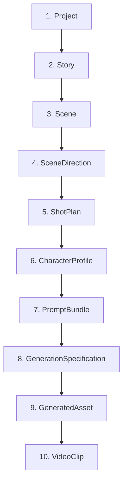

# Pipeline Specification

This specification documents the data structures, lifecycle rules, validation requirements, and flows for every object across the entire AI Studio Production Pipeline.

---

## Data flow Hierarchy

---

## 1. Project

* **Purpose**: Represents the foundational configuration, style guidelines, and parameters for an entire content production.
* **Producer**: API / Client
* **Consumer**: ProjectPipeline Orchestrator, StoryStage, JobBuilderStage
* **Lifecycle**: Created by the user. Persisted in the database. Remains active throughout the lifecycle of all associated stories, scenes, and media generation jobs.
* **Required Fields**:
  * `id` (int): Database key.
  * `title` (str): Title of the production.
  * `video_type` (str): Duration/type preset (e.g. `short`, `medium`, `long`).
  * `target_duration_seconds` (float): Target total output duration.
  * `aspect_ratio` (str): Resolution ratio (e.g. `16:9`, `9:16`).
  * `language` (str): Production language.
* **Optional Fields**:
  * `art_style` (str): Core target art style (e.g. `anime`, `cinematic`).
  * `narration_style` (str): Voiceover/narrative perspective.
  * `subtitle_language` (str): Secondary subtitles language.
  * `voice_gender` (str): Narrator voice gender preference.
* **Validation Rules**:
  * `aspect_ratio` must match format `W:H` (e.g., `16:9`, `1:1`, `9:16`).
  * `target_duration_seconds` must be greater than zero.

---

## 2. Story

* **Purpose**: Holds the complete narrative structure, plot text, and metadata generated by LLM providers.
* **Producer**: StoryStage (StoryGenerator)
* **Consumer**: SceneDirectorStage, CharacterRegistryStage
* **Lifecycle**: Generated during the first phase of the ProjectPipeline. Persisted to the database. Linked to a parent Project.
* **Required Fields**:
  * `id` (int): Database key.
  * `project_id` (int): Foreign key to Project.
  * `title` (str): Story title.
  * `story_text` (str): The complete raw story script/book text.
  * `status` (str): Operational status (e.g., `draft`, `completed`).
* **Optional Fields**:
  * `genre` (str): Story genre (e.g. `Fantasy`, `Sci-Fi`).
  * `summary` (str): Short narrative synopsis.
  * `version` (int): Story revision counter.
* **Validation Rules**:
  * `project_id` must reference a valid Project record.
  * `story_text` must not be empty.

---

## 3. Scene

* **Purpose**: Breaks down the story narrative into sequential narrative locations or time blocks.
* **Producer**: StoryStage (StoryParser/StoryGenerator)
* **Consumer**: SceneDirectorStage, CharacterRegistryStage, JobBuilderStage
* **Lifecycle**: Created during story parsing/generation. Persisted in the database. Linked to a parent Episode/Story.
* **Required Fields**:
  * `id` (int): Database key.
  * `episode_id` (int): Foreign key to parent Episode.
  * `scene_number` (int): Position of the scene in the episode sequence.
  * `title` (str): Name/location of the scene.
  * `status` (str): Operational status (`draft`, `completed`).
* **Optional Fields**:
  * `narration` (str): Voiceover or narrative text to be read during this scene.
  * `camera_notes` (str): Aesthetic framing or direction notes.
  * `duration_seconds` (float): Target time length.
* **Validation Rules**:
  * `scene_number` must be greater than or equal to 1.
  * `duration_seconds` (if present) must be positive.

---

## 4. SceneDirection

* **Purpose**: Encapsulates cinematic and framing notes, lighting directions, mood guidelines, and shot suggestions for a single scene.
* **Producer**: SceneDirectorStage (SceneDirector)
* **Consumer**: ShotPlannerStage
* **Lifecycle**: Evaluated in-memory (or stored via JSON/metadata). Created after StoryStage finishes parsing.
* **Required Fields**:
  * `scene_id` (int): Associated database scene identifier.
  * `mood` (str): Emotional color of the scene (e.g. `Tense`).
  * `lighting` (str): Lighting design guidelines.
  * `primary_focus` (str): Focal subject of the scene.
  * `camera_style` (str): General camera approach (e.g. `Handheld`).
  * `composition_rule` (str): Prevalent framing rule.
  * `camera_movement` (str): Primary camera movement.
  * `visual_notes` (str): Overall grading and style directives.
* **Optional Fields**:
  * `suggested_shots` (List[ShotDirection]): List of suggested shots.
  * `estimated_duration` (float): Derived duration in seconds.
  * `metadata` (dict): Extensible tags.
* **Validation Rules**:
  * `scene_id` must refer to an existing Scene.
  * `estimated_duration` must be positive.

---

## 5. ShotPlan

* **Purpose**: Breaks down a SceneDirection into a detailed, executable set of sequential visual shots with specific framing and timing.
* **Producer**: ShotPlannerStage (ShotPlanner)
* **Consumer**: CharacterRegistryStage, JobBuilderStage
* **Lifecycle**: Instantiated in-memory during ProjectPipeline, and attached to the PipelineContext. Used to build generation tasks.
* **Required Fields**:
  * `scene_id` (int): Target scene reference.
  * `shot_number` (int): Sequential index within the scene.
  * `shot_type` (str): Framing type (e.g. `Establishing`, `Close-up`).
  * `camera_angle` (str): Vertical angle (e.g. `Low Angle`).
  * `camera_movement` (str): Movement type (e.g. `Tracking`).
  * `composition` (str): Spatial layout rule.
  * `focus_subject` (str): Primary focal entity.
  * `duration_seconds` (float): Duration allocated to this shot.
  * `transition_in` (str): Entry transition (e.g. `Fade In`).
  * `transition_out` (str): Exit transition (e.g. `Cut`).
* **Optional Fields**:
  * `description` (str): Narrative description of the shot.
  * `visual_notes` (str): Specific color/aesthetic tips.
  * `scene_direction_id` (int): Optional parent SceneDirection link.
  * `metadata` (dict): Extensible metadata.
* **Validation Rules**:
  * `duration_seconds` must be between `0.5` and `30.0` seconds.
  * `shot_number` must be greater than or equal to 1.

---

## 6. CharacterProfile

* **Purpose**: Stores the canonical visual consistency traits, prompts, history, and active visual states for a character.
* **Producer**: CharacterRegistryStage (CharacterRegistry)
* **Consumer**: PromptBuilder (Future)
* **Lifecycle**: Compiled after ShotPlans are created. Cached in `PipelineContext` and used to sync prompts.
* **Required Fields**:
  * `character_id` (int): Database key to `Character`.
  * `canonical_name` (str): Normalized character name.
  * `current_visual_state` (CharacterVisualState): Active outfit, expressions, and attributes.
* **Optional Fields**:
  * `aliases` (List[str]): Extracted aliases.
  * `appearance_summary` (str): Textual details.
  * `hairstyle` (str) / `hair_color` (str) / `eye_color` (str) / `skin_tone` (str) / `body_type` (str) / `age_group` (str): Visual consistency fields.
  * `default_outfit` (str) / `accessories` (str): Wardrobe/props.
  * `expression_defaults` (str) / `pose_defaults` (str): Base postures.
  * `visual_notes` (str) / `reference_prompt` (str) / `negative_prompt` (str): Prompt seeds.
  * `scene_history` (List[int]) / `shot_history` (List[int]): Tracked references.
* **Validation Rules**:
  * If a trait is missing from database source text, it **MUST** remain `None` (do not invent attributes).

---

## 7. PromptBundle

* **Purpose**: Holds the modular elements of a prompt (style, camera, lighting, character details) prior to combining them into a single string.
* **Producer**: PromptBuilderStage (Future)
* **Consumer**: GenerationSpecificationStage
* **Lifecycle**: Constructed per shot, utilizing the ShotPlan and active CharacterProfiles. Passed forward to generate render contracts.
* **Required Fields**:
  * `shot_id` (str): Unique identifier format: `{scene_id}_{shot_number}`.
* **Optional Fields**:
  * `positive_prompt_parts` (List[str]) / `negative_prompt_parts` (List[str]): Raw text inputs.
  * `style_tags` / `quality_tags` / `camera_tags` / `character_tags` / `environment_tags` / `lighting_tags` / `composition_tags` / `technical_tags` (List[str]): Segmented tags.
  * `metadata` (dict): Extensible tracking metadata.
* **Validation Rules**:
  * Modular lists must remain separate and editable. Concatenation is done exclusively at the generation/export step.

---

## 8. GenerationSpecification

* **Purpose**: Represents the single, immutable production-ready contract containing all parameters needed for the worker to generate a visual asset.
* **Producer**: GenerationSpecificationStage (Future)
* **Consumer**: Worker (Image Generator)
* **Lifecycle**: Built per shot, persisted as the config for a `GenerationJob`, and sent to the worker task queue.
* **Required Fields**:
  * `version` (str): Version of the specification schema (defaults to `"1.0"`).
  * `job_id` (str): Associated GenerationJob reference.
  * `provider` (str): The targeted model provider (e.g. `flux`).
  * `model` (str): The target model variant (e.g. `flux-dev`).
  * `prompt_bundle` (PromptBundle): The modular prompt config.
  * `generation_parameters` (dict): Resolution, steps, seed, and sampler settings.
  * `output_configuration` (dict): Aspect ratios and target formats.
  * `storage_configuration` (dict): Destination bucket and path.
* **Optional Fields**:
  * `metadata` (dict): Retry info, timestamps, and transient worker stats.
* **Validation Rules**:
  * Must be serializable to valid JSON.
  * `version` must follow semantic version formats (e.g. `1.0`).

---

## 9. GeneratedAsset (Future)

* **Purpose**: Records the details, metrics, and storage URI of a successfully rendered visual asset (image) returned by the worker.
* **Producer**: Worker / Callback Receiver
* **Consumer**: VideoComposer, Frontend API
* **Lifecycle**: Created when a worker finishes rendering an image. Saved in database. Linked to a parent `GenerationJob` and `ShotPlan`.
* **Required Fields**:
  * `id` (int): Database key.
  * `job_id` (str): Reference to parent job.
  * `storage_uri` (str): Accessible path (e.g. S3 / GCS URL).
  * `width` (int) / `height` (int): Render dimensions.
  * `file_size_bytes` (int): Payload weight.
  * `generation_time_seconds` (float): Render performance metric.
* **Optional Fields**:
  * `seed_used` (int): Actual seed from generator.
  * `metadata` (dict): Operational tags.

---

## 10. VideoClip (Future)

* **Purpose**: Tracks the compiled video clip combining narration audio, subtitles, and the generated visual asset.
* **Producer**: VideoCompilationStage (Worker / Backend ffmpeg task)
* **Consumer**: VideoPlayer / Frontend Download
* **Lifecycle**: Compiled at the final stage of Episode/Project production. Merged into the output timelines.
* **Required Fields**:
  * `id` (int): Database key.
  * `scene_id` (int) / `shot_number` (int): Placement references.
  * `video_uri` (str): Location of output file.
  * `audio_uri` (str): Voiceover audio track file location.
  * `duration_seconds` (float): Timing metric.
* **Optional Fields**:
  * `subtitle_file_uri` (str): Path to generated SRT/VTT.
  * `metadata` (dict): Codecs and render quality specs.
