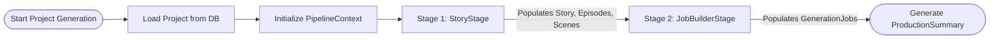
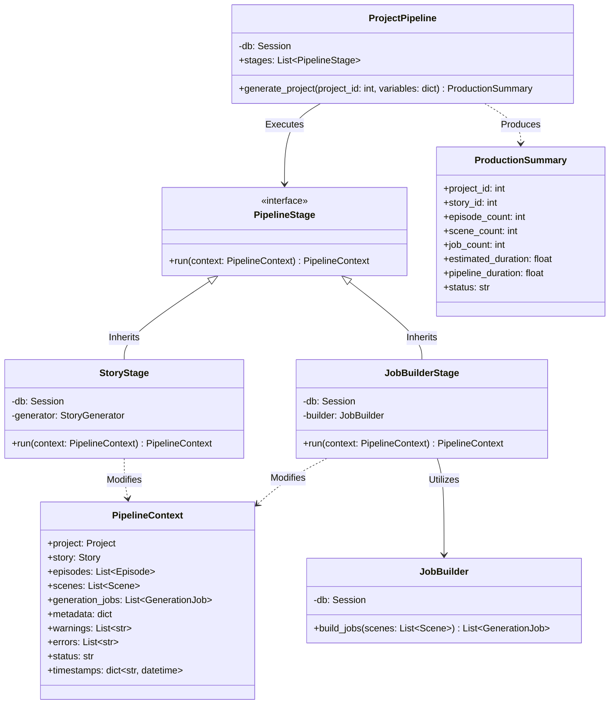
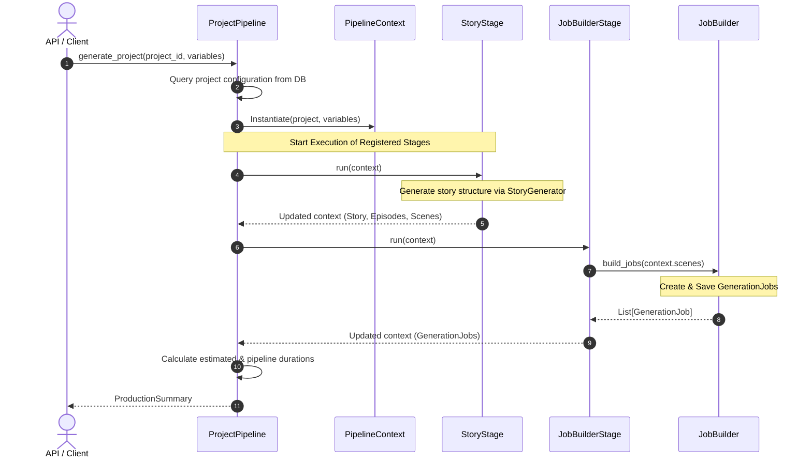

# Sprint 22 — Project Generation Orchestrator Layer

This document outlines the architecture, pipeline flow, class dependencies, and future extensibility of the AI Project Orchestrator introduced in Sprint 22.

---

## 1. Architecture

Sprint 22 introduces a decoupled, stage-based orchestration layer that structures project creation into consecutive, isolated steps. This prevents business logic and state management from leaking into the core pipeline execution model.

The architecture comprises three main components:
1. **`PipelineContext`**: A unified state object that is passed through and modified by all pipeline stages.
2. **`PipelineStage`**: An abstract interface defining the contract for all processing steps.
3. **`ProjectPipeline`**: An orchestrator that loads the project, builds the initial context, runs all registered stages sequentially, handles failures, and returns a detailed `ProductionSummary`.

---

## 2. Pipeline Flow Diagram

The project generation flow is sequenced as follows:

---

## 3. Class Diagram

---

## 4. Execution Sequence

The complete E2E execution lifecycle runs synchronously within a database transaction boundary:

---

## 5. Future Stages

The stage-based architecture is designed for plug-and-play expansion. Future sprints can register additional stages in `ProjectPipeline.stages` without rewriting existing code:

1. **`CharacterRegistryStage`**: Analyzes the generated story and auto-registers new Characters and Character-Scene associations in the database.
2. **`ShotPlannerStage`**: Breaks down generated scene narration into granular camera shots and cinematic sequences.
3. **`AssetAllocationStage`**: Directs the pre-production layout, locating reusable background layouts and setting references.
