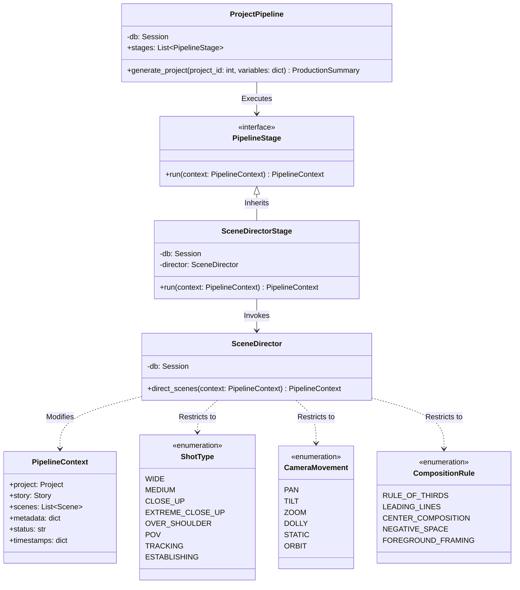

# Sprint 23 — Cinematic Scene Director Layer

This document outlines the architecture, pipeline flow, class dependencies, and future AI integration for the Cinematic Scene Director Stage introduced in Sprint 23.

---

## 1. Architecture

The Scene Director is an orchestration step responsible for analyzing story scenes and establishing creative parameters for subsequent shot layout and generation. It operates directly on the shared `PipelineContext`, inserting structured cinematic guides into the `context.metadata["scene_direction"]` dictionary.

Key components:
*   **`SceneDirector`**: Main service class that plans lighting, mood, compositions, and recommended shot sequences for every scene.
*   **`ShotType`**: Enum containing framing constraints (e.g., Wide, Close-up, POV).
*   **`CameraMovement`**: Enum containing motion vectors (e.g., Pan, Tilt, Dolly).
*   **`CompositionRule`**: Enum containing framing aesthetics (e.g., Rule of Thirds, Negative Space).
*   **`SceneDirectorStage`**: Orchestrator stage wrapping the Director service, conforming to the `PipelineStage` interface.

---

## 2. Pipeline Flow Diagram

The Scene Director stage acts immediately after the `StoryStage` and before the `JobBuilderStage` (which constructs final queue jobs).

---

## 3. Class Diagram

---

## 4. Future AI Integration

Currently, the `SceneDirector` operates with predefined cinematic guidelines to establish the interface contracts and ensure pipeline stability. In future sprints:
1. **Gemini Prompt Injection**: We will leverage the `GeminiProvider` with a dedicated prompt (`app/prompts/scene_prompt.txt`) to dynamically analyze scene text and output tailored moods, lighting details, and shot sequences.
2. **Shot Planner Connection**: A downstream `ShotPlannerStage` will parse the suggested shot sequences inside `context.metadata["scene_direction"]` to map them directly to database storyboard assets.
3. **Prompt Builder Integration**: The `PromptBuilder` will pull camera descriptions and lighting hints from `scene_direction` to construct more descriptive prompts for the image generation models.
