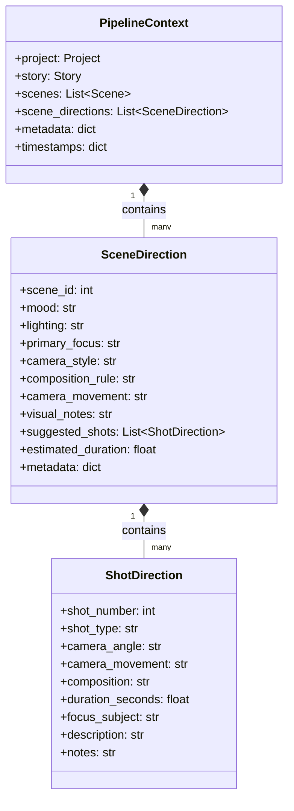

# Sprint 23.5 — Scene Direction Model Refactoring & Package Reorganization

This document outlines the architecture, reason for refactoring, old vs new design, package structure, class diagram, and future Shot Planner integration for Sprint 23.5.

---

## 1. Architecture & Reason for Refactor

In Sprint 23, we introduced the `SceneDirector` which generated nested dictionaries inside `context.metadata["scene_direction"]`. 
As the project grows, downstream stages like `ShotPlanner`, `PromptBuilder`, and `Worker` need to consume this data. Relying on unstructured, typeless dictionaries inside metadata leads to runtime bugs, typing omissions, and makes validation brittle.

In Sprint 23.5, we elevated **SceneDirection** and **ShotDirection** into typed, first-class domain models (using standard Python `@dataclass`) and reorganized the AI service package into logical, clean subpackages.

---

## 2. Old vs New Design

### Old Structure
*   **Data Layout**: Typeless dictionary stored under `PipelineContext.metadata["scene_direction"]`.
*   **Package Layout**: Direct imports mixed in the top-level directory (`services/ai/`).

### New Structure
*   **Data Layout**: Fully typed `@dataclass` models (`SceneDirection` and `ShotDirection`) stored inside a typed list: `PipelineContext.scene_directions`. Backward compatibility is preserved by continuing to populate the old metadata dictionary structure.
*   **Package Layout**: Organized subpackages (`pipeline/`, `models/`, `generators/`, `parsers/`, `validators/`, `repositories/`, `builders/`, `directors/`, `stages/`, `utils/`). Backward-compatible forwarding modules exist at the top-level.

---

## 3. Class Diagram

---

## 4. Pipeline Execution Diagram

---

## 5. Future Shot Planner Integration

In Sprint 24:
1. **Shot Mapping**: The `ShotPlannerStage` will process `context.scene_directions` to create discrete `Shot` database models for every `ShotDirection`.
2. **Resource Allocation**: The estimated durations (`duration_seconds`) of each shot will be used to allocate rendering compute budgets and timing tracks for the final video timeline.
