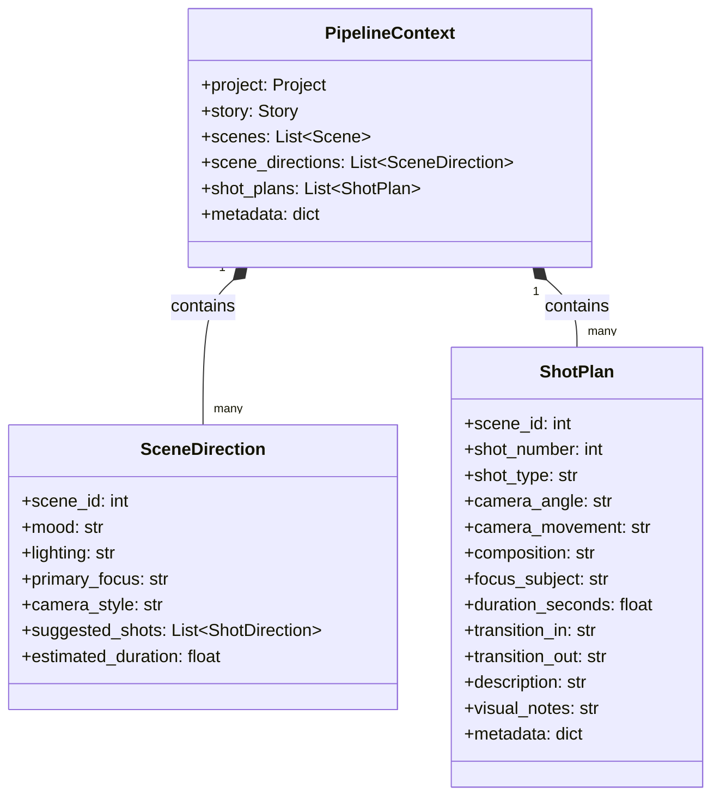
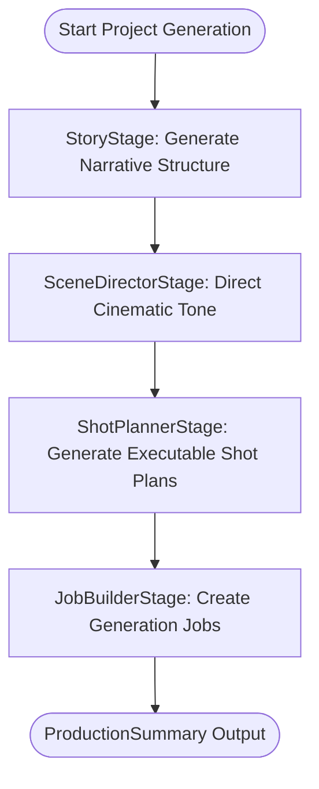

# Sprint 24 — Shot Planner Stage

This document outlines the architecture, planning rules, class diagram, pipeline execution flow, and future PromptBuilder integration for Sprint 24.

---

## 1. Architecture

Sprint 24 introduces the **Shot Planner Stage**, which acts as the intermediary between the high-level cinematic constraints defined by the `SceneDirector` and the downstream generation worker. 
Rather than passing generic directorial suggestions directly to the rendering engines, the Shot Planner translates them into discrete, structured, and deterministic `ShotPlan` objects.

---

## 2. Planning Rules

The Shot Planner uses a deterministic rule engine to split scene-level directions into concrete shots:
1. **Scene Duration Splitting**:
   - **Short Scenes** (<= 10 seconds): Planned for 1–2 shots.
   - **Medium Scenes** (10 to 20 seconds): Planned for 3–5 shots.
   - **Long Scenes** (> 20 seconds): Planned for 5–8 shots.
2. **Wide Shot First**: The first shot of every scene is forced to be a Wide/Establishing shot to set the scene environment context.
3. **Close-ups on Emotion**: If the scene's mood is emotional or dramatic (e.g., Dramatic, Tense, Mysterious), a Close-up shot framing character expressions is automatically scheduled near the end of the scene.
4. **Transition Rules**:
   - The first shot of a scene has a transition in set to `Fade In`.
   - The last shot of a scene has a transition out set to `Fade Out`.
   - Intermediate shots use a standard `Cut` transition.
5. **Compute Allocation**: The estimated scene duration is divided evenly across all planned shots.

---

## 3. Class Diagram

---

## 4. Pipeline Flow

---

## 5. Future PromptBuilder Integration

In Sprint 25:
* **Diffusion Prompt Synthesis**: The `PromptBuilderStage` will consume `context.shot_plans` directly.
* **Component Prompts**: The prompt builder will concatenate the project's art style, the shot's focus subject, composition rules, camera angles, and visual notes into a highly optimized prompt string tailored for Diffusion models (e.g., Stable Diffusion, Midjourney, Fal AI).
* **Automated Seed/Style Injection**: Specific metadata inside the `ShotPlan` will guide seed variations for consistent characters across sequential shots.
