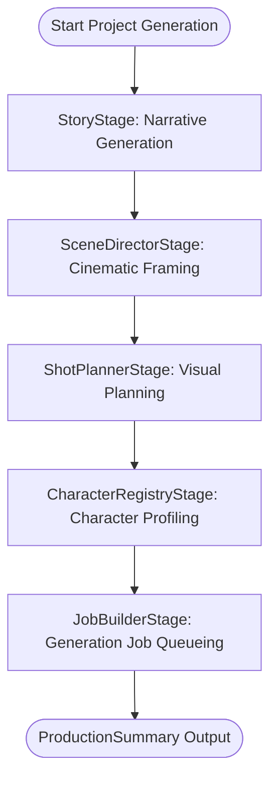

# Sprint 25 — Character Registry & Visual Consistency Engine

This document details the architecture, registry lifecycle, normalization/matching strategies, `CharacterProfile` model structure, pipeline integration, future plans, and Character Model Gap Analysis for Sprint 25.

---

## 1. Architecture

The **Character Registry Stage** acts as the canonical source of truth for all recurring characters throughout the story generation pipeline. It bridges the gap between text-based narration (Story, Episodes, Scenes) and visual-spatial execution (Shots, Prompts, Image Generation).

Its primary objective is to maintain strict visual consistency:
* Ensures downstream prompt builders always use the same physical descriptions (hair color, hairstyle, clothes, skin tone) for a character.
* Resolves spelling variations, case mismatches, and aliases to a single database entity.
* Tracks character participation across scenes and shots to enable contextual adjustments (e.g., changes in emotional expression or default outfits).

---

## 2. Registry Lifecycle

The registration process consists of four phases:
1. **Extraction**: The system identifies candidate character references from metadata variables, database relations, and scene narrations.
2. **Normalization**: Raw names are cleaned (whitespace stripped, cased as title-case, internal spacing normalized) and checked against registered alias mappings.
3. **Matching & De-duplication**: Candidate names are matched against existing database records using exact, alias-based, or substring overlap rules. Unmatched names trigger the creation of new `Character` records.
4. **Profiling**: An in-memory, rich `CharacterProfile` is built for each character, capturing physical attributes, visual prompts, and complete scene/shot indexes.

---

## 3. Normalization & Matching Strategies

### Normalization Strategy
* **Basic Normalization**: Trims leading/trailing whitespace, consolidates internal whitespace, and formats names into standard title-case (e.g. `"  kai  "` -> `"Kai"`, `"KAI"` -> `"Kai"`).
* **Alias Resolution**: Maintains a case-insensitive lookup table mapping alternative names (e.g., `"Commander Kai"`) to their canonical forms (e.g., `"Kai"`).
* **Future Multilingual Hook**: Structured to easily integrate transliteration and Unicode normalizations for cross-lingual story naming.

### Matching Strategy
* **Exact Canonical Match**: If normalized candidate matches database name exactly (confidence = 1.0).
* **Alias Match**: If candidate matches one of the comma-separated aliases stored in the DB (confidence = 1.0).
* **Fuzzy Overlap Match**: If candidate has significant word-level overlap (using intersection ratio), it resolves to the best DB match with a confidence score (confidence <= 0.8).
* **Fallback to Creation**: Any candidate below the confidence threshold (0.8) is registered as a new character to avoid mixing distinct story personas.

---

## 4. Character Profile Structure

The runtime representation is encapsulated in the `CharacterProfile` dataclass:
* **Identification**: `character_id`, `canonical_name`, `aliases`.
* **Visual Attributes**: `appearance_summary`, `hairstyle`, `hair_color`, `eye_color`, `skin_tone`, `body_type`, `age_group`, `default_outfit`, `accessories`.
* **Behavioral Cues**: `expression_defaults`, `pose_defaults`.
* **Generation Anchors**: `reference_prompt` (positive tokens), `negative_prompt` (drift prevention tokens), `visual_notes`.
* **History Indices**: `scene_history` (List of scene database IDs), `shot_history` (List of shot numbers).
* **Extensibility**: `metadata` (Dict mapping).

---

## 5. Pipeline Integration

The pipeline execution flow is updated as follows:

The `CharacterRegistryStage` updates the `PipelineContext` by populating:
* `context.characters`: List of active DB character models.
* `context.character_profiles`: Mapping of character canonical name -> `CharacterProfile`.
* `context.character_scene_index`: Mapping of character canonical name -> List of Scene IDs.
* `context.character_shot_index`: Mapping of character canonical name -> List of Shot numbers.

---

## 6. Future PromptBuilder Integration

During the upcoming `PromptBuilderStage`:
1. **Dynamic Character Insertion**: The prompt builder will parse the shot plan description. When it detects a character name (or alias), it will substitute/append the character's `reference_prompt` and visual descriptors (e.g., `"blue eyes, silver hair, wearing armor"`) directly into the final image generation prompt.
2. **Expression/Pose Injector**: Based on the shot's emotional context and the character's `expression_defaults`, the builder will inject specific expression tags (e.g., `"smiling face"`, `"determined gaze"`).

---

## 7. Character Model Gap Analysis

The database model (`Character`) was audited against the visual consistency requirements.

### Fields Already Available
* **Physical Traits**: `age`, `gender`, `species`, `height_cm`, `body_type`, `hair_color`, `hair_style`, `eye_color`, `skin_tone`.
* **Style & Clothing**: `clothing`, `accessories`, `face_description`, `art_style_override`.
* **Prompts**: `reference_prompt`, `negative_prompt`.
* **Metadata**: `name`, `aliases`, `role`, `description`, `consistency_notes`.

### Fields Only Required at Runtime (`CharacterProfile`)
* **Tracking Lists**: `scene_history` and `shot_history` change per project production run. They are computed dynamically based on the current episode/scene narration.
* **Orchestration Metadata**: Execution-specific tracking parameters, such as matched confidence scores or transient pipeline settings.

### Fields for Future Database Migrations (Optional)
If visual consistency demands more granular control, the following fields should be migrated from raw text descriptors to explicit schema columns:
1. `expression_defaults` (String/Enum): To specify neutral face modifiers (e.g., `"stoic"`, `"cheerful"`) without parsing descriptions.
2. `pose_defaults` (String/Enum): Default stance or body language markers.
3. `is_major` (Boolean): A flag indicating if the character is a main protagonist, allowing the pipeline to allocate more compute or trigger multi-stage consistency workflows.
