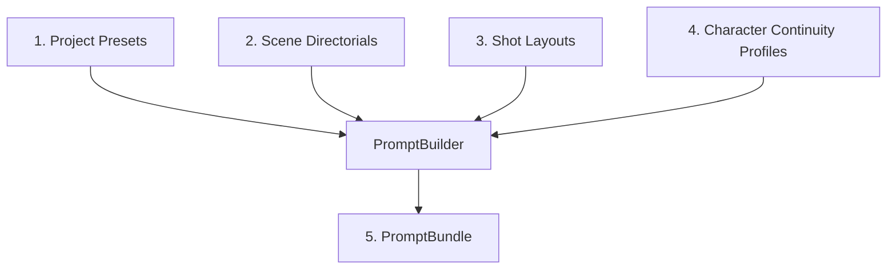

# Sprint 26 — Prompt Builder Engine

This document details the architecture, configuration, template engines, and visual styling rules introduced in Sprint 26.

---

## 1. Architecture

The `PromptBuilder` stage sits between the visual consistency/character tracking engine (`CharacterRegistryStage`) and the job/worker task generation engine (`GenerationSpecificationStage`).

---

## 2. Prompt Composition & Templates

Instead of hardcoding prompt structures in Python code, Sprint 26 implements a template-driven compilation engine. Templates are loaded from disk from the `app/prompts` directory:

1. `positive_prompt_template.txt`: Defines the deterministic ordering and category tags injection points.
2. `negative_prompt_template.txt`: Defines the base and character-specific negative bounds.

---

## 3. Prompt Ordering

To ensure optimal styling and semantic fidelity with modern diffusion models (like Flux or SDXL), prompt tags are concatenated in a strictly deterministic sequence:

`positive parts -> style -> quality -> camera -> character -> environment -> lighting -> composition -> technical`

Duplicates are dynamically removed case-insensitively during compilation while preserving the original casing of their first appearance. Empty elements and excess whitespace are normalized automatically.

---

## 4. Prompt Profiles (Multi-Style Support)

We support the following style profiles:
* **Anime**: Curated tags for hand-drawn, vibrant key visual aesthetics.
* **Realistic (Placeholder)**: Curated photorealistic camera settings and high-fidelity textures.
* **Cinematic (Placeholder)**: Film-grain, anamorphic distortion, and low-key aesthetic tags.

---

## 5. Continuity and Character Safety

The `PromptBuilder` **never** invents or fabricates missing traits for character profiles. If attributes (like hair color or eye color) are absent from the source registry, they are skipped. Visual state continuity elements (current outfits, temporary injuries, pose cues, active props) are dynamically merged from the runtime `CharacterVisualState` without fabricating new details.
