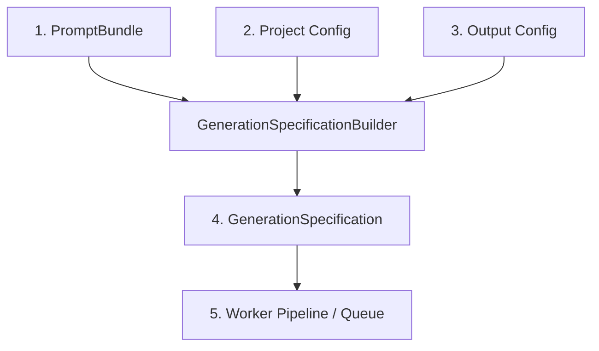

# Sprint 27 — Generation Specification Builder

This document describes the architectural flow, schema, and validation contract for the `GenerationSpecificationBuilder` implemented in Sprint 27.

---

## 1. Architecture

The `GenerationSpecificationBuilder` packages prompt bundles and project config inputs into a unified payload ready for execution by downstream worker agents:

---

## 2. GenerationSpecification Schema

The schema represents the canonical contract for image generation:

| Field | Type | Description |
|---|---|---|
| `job_id` | `str` | Unique job identifier mapping to target scene/shot. |
| `provider` | `str` | Target rendering engine (e.g. `'flux'`, `'mock'`). |
| `model` | `str` | Specific rendering model version to invoke. |
| `compiled_positive_prompt` | `str` | Deterministically ordered, deduplicated positive prompt. |
| `compiled_negative_prompt` | `str` | Concatenated negative prompt bounds. |
| `generation_parameters` | `dict` | Execution params (width, height, steps, guidance scale, seed). |
| `output_configuration` | `dict` | Output attributes (filename, image format, aspect ratio). |
| `storage_configuration` | `dict` | Abstract storage path instructions (no assumptions on S3). |
| `version` | `str` | Contract version indicator (e.g., `'1.0'`). |
| `metadata` | `dict` | Extensible key-value metadata. |

---

## 3. Compilation Flow

1. **Prompt Extraction**: Standard positive/negative prompt string compilation methods of `PromptBundle` are used directly (preventing duplicated prompt-assembly logic).
2. **Resolution Mapping**: Project aspect ratios (e.g., `'16:9'`, `'9:16'`) are mapped to concrete pixels (e.g., `1024x576`, `576x1024`).
3. **Validation Guardrails**: Payloads undergo validation against:
   * Empty prompts.
   * Unsupported providers (allowed list customizable).
   * Invalid resolutions (non-positive dimensions).
   * Negative seed values.
   * Missing output paths.
