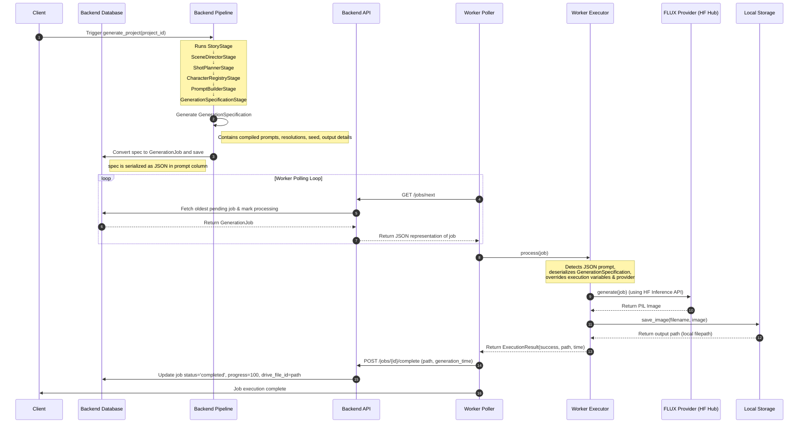

# Sprint 28 — First End-to-End Image Generation

This sprint establishes the first end-to-end integration between the main **AI Studio Backend** and the **Worker Service**, executing the complete pipeline flow to produce and save real PNG images.

---

## 1. End-to-End Execution Flow

The sequence of data transformations and execution across the Backend and Worker is illustrated in the diagram below:

---

## 2. Backend / Worker Interface Contract

To maintain 100% backward compatibility and avoid database schema redesigns, the backend and worker utilize the **GenerationSpecification Serialized JSON Protocol**:

1. **Serialization on Backend**:
   - `create_job_from_spec` converts the completed `GenerationSpecification` into a standard `GenerationJob` database model.
   - The entire `GenerationSpecification` dictionary is serialized to a JSON string and saved inside the `prompt` column (a `Text` field).
   - Downstream metadata like `compiled_negative_prompt` is saved in `negative_prompt`, and filename is saved in `filename`.

2. **Deserialization on Worker**:
   - The worker poller retrieves the standard `GenerationJobResponse` payload from the `/jobs/next` API endpoint.
   - The Worker `Executor` attempts to parse `job.prompt` as JSON.
   - If it parses successfully and represents a `GenerationSpecification`, the worker treats the specification as the absolute source of truth:
     - The actual prompt is extracted from `compiled_positive_prompt`.
     - The image provider (e.g. `"flux"` or `"mock"`) is resolved dynamically from the spec.
     - Hyperparameters like `width`, `height`, `seed`, `guidance_scale`, and `steps` are extracted and passed to the image provider.
   - If the JSON parsing fails (e.g., standard text prompt), the worker falls back to the original text-only mode for backward compatibility.

---

## 3. Image Generation Lifecycle & Reporting

- **Started State**: When the poller fetches the job, the backend marks it as `"processing"`. The worker calls `report_started()` which hits `/jobs/{id}/progress` with `progress=0`.
- **Progress Updates**: Periodic progress updates (e.g., `50%` after generation completes but before storage completes) are reported.
- **Completion Callback**: Once the image is saved to storage, the worker calls `report_completed()` which POSTs to `/jobs/{id}/complete`. The backend updates the job's `status` to `"completed"`, sets `progress` to `100`, records the execution `generation_time`, and saves the file path under `drive_file_id`.
- **Failure Callback**: If any exception occurs during provider generation or file storage, the worker calls `report_failed()` which hits `/jobs/{id}/failed` with the error details. The backend marks the job as `"failed"` and records the `error_message`.

---

## 4. Failure Handling & Recovery Strategy

| Failure Scenario | Impact | Mitigation / Recovery |
| :--- | :--- | :--- |
| **Network Failure (Fetching/Reporting)** | Worker cannot fetch jobs or report status. | Worker retries connection to Backend API with exponential backoff. Jobs remain in `"pending"` or `"processing"` state on the backend. |
| **Hugging Face / FLUX API Error (e.g., 402, 503)** | Generation fails. | The worker catches provider exceptions, classifies them (e.g. `PermissionError`, `TimeoutError`), reports the failure message to `/jobs/{id}/failed`, and marks the job as `"failed"`. |
| **Local Storage Full** | Cannot save generated PNG. | Handled as a write exception. The worker reports the failure to the backend so the pipeline doesn't hang. |
| **Job Timeout** | Worker hangs or crash mid-execution. | A cron-like reaper or heartbeat monitor on the backend can identify jobs stuck in `"processing"` for too long and reset them to `"pending"`. |
