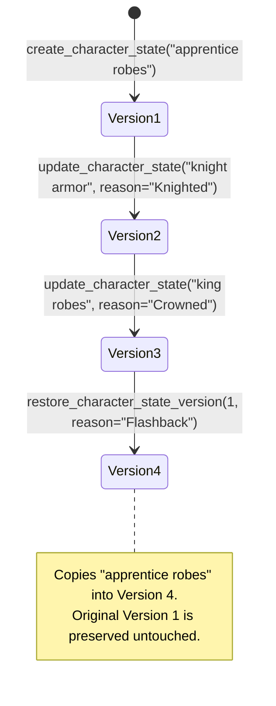
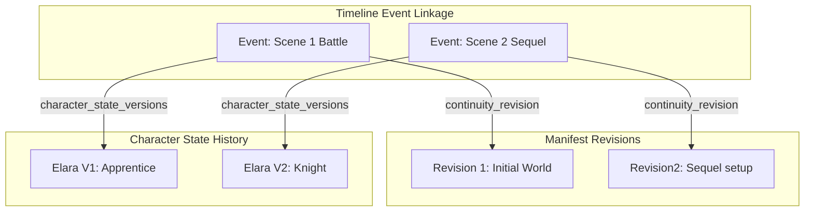
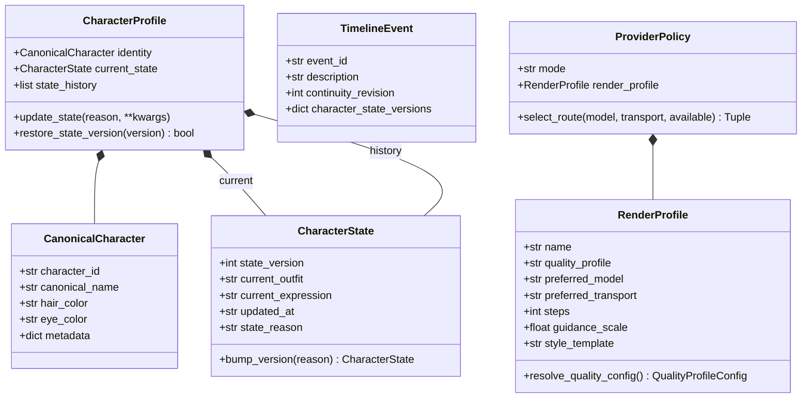
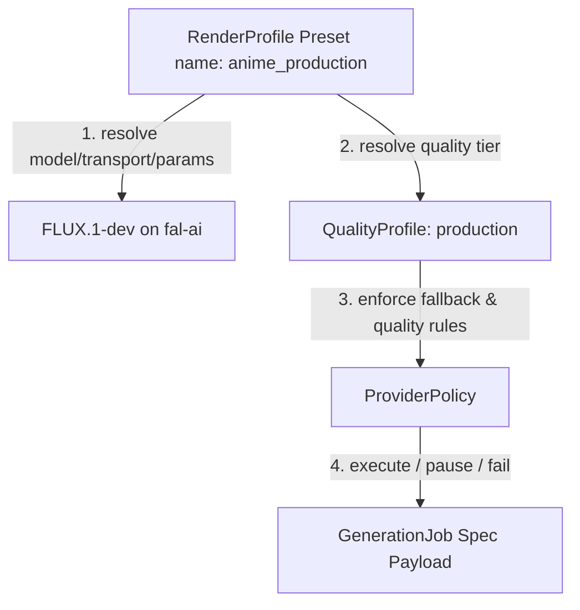

# Sprint 29.1 — Architecture Refinement & Long-Term Continuity

## Objective
A pure refinement sprint that eliminates future technical debt before the Asset Registry (Sprint 30). It establishes robust continuity manifests, versioned character states, narrative timelines, and render profiles. All changes maintain 100% backward compatibility.

---

## 1. Updated File Tree

```
app/services/ai/
├── continuity/
│   ├── __init__.py                  ← exports all new types
│   ├── continuity_manifest.py       (unchanged)
│   ├── continuity_snapshot.py       (unchanged)
│   ├── continuity_manager.py        ← UPDATED: revision history, timeline/profile persistence, state versioning APIs
│   ├── continuity_resolver.py       ← UPDATED: canonical/state split, state helpers
│   ├── canonical_character.py       ← UPDATED: versioned CharacterState, CharacterProfile history, immutable ID
│   ├── manifest_revision.py         ← NEW: RevisionHistory dataclass
│   ├── revision_manager.py          ← NEW: append / list / restore revision history
│   └── narrative_timeline.py        ← UPDATED: NarrativeTimeline with revision & state version linkage
└── policies/
    ├── __init__.py                  ← exports QualityProfile, RenderProfile types
    ├── quality_mode.py              (unchanged)
    ├── provider_route.py            (unchanged)
    ├── provider_policy.py           ← UPDATED: RenderProfile -> QualityProfile -> ProviderPolicy hierarchy
    ├── quality_profile.py           ← NEW: QualityProfile enum + configs
    └── render_profile.py            ← NEW: RenderPreset model, scheduler, template & preset registry
```

---

## 2. RenderProfile Architecture (Task 3 & 4)

`RenderProfile` represents a complete rendering preset that decouples project configuration from concrete model names. Projects reference a `RenderProfile` by name (e.g. `anime_production`), which in turn references the actual model name (e.g. `black-forest-labs/FLUX.1-dev`). This ensures future model upgrades (like migrating to new versions of FLUX or other models) can be done by changing only the profile definition, without touching any project records.

### Built-in Anime Presets

| RenderProfile | Quality Tier | Preferred Model | Preferred Transport | Width/Height | Steps | Guidance | Style Template |
|---|---|---|---|---|---|---|---|
| **`anime_draft`** | `quick_draft` | `FLUX.1-schnell` | `huggingface` | 512x288 | 15 | 3.5 | `anime style, cel-shading, flat colors` |
| **`anime_preview`** | `preview` | `FLUX.1-schnell` | `huggingface` | 768x432 | 28 | 5.0 | `anime style, vibrant colors, detailed line art` |
| **`anime_production`** | `production` | `FLUX.1-dev` | `fal-ai` | 1024x576 | 50 | 7.5 | `anime style, cinematic lighting, highly detailed, 4k` |
| **`anime_master`** | `master` | `FLUX.1-dev` | `fal-ai` | 2048x1152 | 60 | 8.5 | `anime style, ultra-detailed, cinematic, masterpiece` |

---

## 3. Character State Version Lifecycle (Task 1)

`CharacterProfile` now cleanly separates the immutable `CanonicalCharacter` identity from a history of versioned `CharacterState` records. Every state update bumps the version and appends a new state to the list, ensuring previous states are never overwritten and remain accessible for flashbacks.



---

## 4. Timeline Revision Linkage (Task 2)

`TimelineEvent` is extended to log the active **continuity manifest revision** and the **character state versions** at the moment the event occurs. This provides complete context when generating flashbacks or performing continuity rollbacks.



---

## 5. System Diagrams

### Class Diagram



### Render Profile Policy Hierarchy



---

## 6. Migration Strategy (Task 5)

1. **Automatic Conversion**: If an existing project has no associated `RenderProfile`, the system calls `RenderProfile.from_quality_profile(quality_profile)` to automatically create a compatible rendering preset.
2. **Backward Compatibility**: `ProviderPolicy` constructors degrade gracefully when no `render_profile` is provided, pulling settings from the legacy `quality_profile` or individual parameters.
3. **Flat Dictionaries**: `CharacterProfile.from_dict()` maps legacy flat keys (like `clothing`) to `state.current_outfit` automatically.
4. **Key Preservation**: Sequels share the same `continuity_key` and register entries via the revision history list rather than duplicating files. `clone_manifest` remains as a deprecated interface emitting `DeprecationWarning`.
