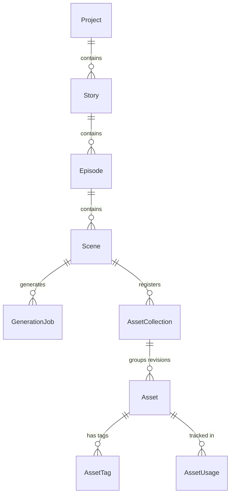
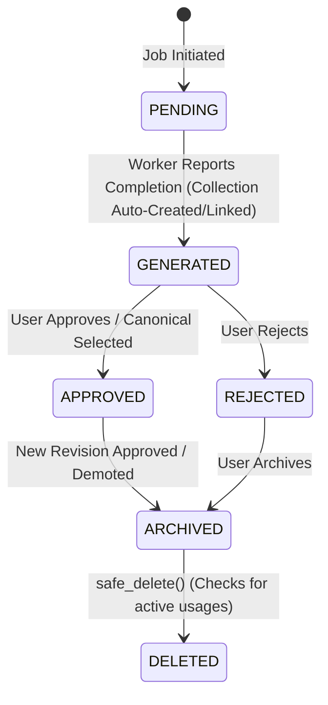

# Sprint 30 — Asset Management System (AMS)

The Asset Management System (AMS) is the canonical source of truth for all generated media assets within AI Studio. It provides long-term reproducibility, detailed revision histories, strict approval workflows, and extensibility hooks for future similarity search, embeddings, quality review, and video assembly.

---

## 1. Core Architecture

The AMS coordinates projects, scenes, shots, and jobs into versioned physical media records. The schema guarantees that we never overwrite previous generations and that we maintain complete history of all attempts.

### Database Schema Reference

#### Asset Table (`assets`)
| Field Name | Type | Description |
| :--- | :--- | :--- |
| `id` | Integer | Primary key |
| `continuity_key` | String | Unique linkage key identifying narrative lines |
| `project_id` | Integer | Associated Project foreign key |
| `episode_id` | Integer | Associated Episode foreign key (optional) |
| `scene_id` | Integer | Associated Scene foreign key |
| `shot_id` | Integer | Associated Shot ID |
| `generation_job_id` | Integer | Job that generated this asset |
| `asset_type` | String | Type of media (e.g., `image`, `video`, `audio`) |
| `image_path` | String | Canonical URI / path to the file |
| `revision` | Integer | Sequential integer representing revision number |
| `status` | Enum | Current approval status |
| `prompt_hash` | String | SHA-256 checksum of compiled positive prompt |
| `compiled_positive_prompt` | Text | Exact positive prompt passed to provider |
| `compiled_negative_prompt` | Text | Exact negative prompt passed to provider |
| `provider` | String | Transport / Provider (e.g., `fal-ai`, `huggingface`) |
| `model` | String | Model ID (e.g., `black-forest-labs/FLUX.1-dev`) |
| `seed` | Integer | Generation seed |
| `width` / `height` | Integer | Image resolution |
| `generation_time` | Float | Serverless generation duration in seconds |
| `collection_id` | Integer | Associated AssetCollection foreign key |
| `metadata_json` | JSON | Holds full generation parameters, render profiles, and future hooks |

#### Asset Collection Table (`asset_collections`)
Groups all revisions of a specific shot.
| Field Name | Type | Description |
| :--- | :--- | :--- |
| `collection_id` | Integer | Primary key |
| `project_id` | Integer | Associated Project |
| `episode_id` | Integer | Associated Episode (optional) |
| `scene_id` | Integer | Associated Scene |
| `shot_number` | Integer | Shot number being versioned |
| `continuity_key` | String | Continuity identifier |
| `collection_name` | String | Human-readable name |
| `canonical_asset_id` | Integer | The currently approved/canonical asset ID |
| `created_at` | DateTime | Timestamp |
| `updated_at` | DateTime | Timestamp |
| `metadata_json` | JSON | Collection metadata |

#### Asset Tag Table (`asset_tags`)
Allows searching assets by extracted keywords.
| Field Name | Type | Description |
| :--- | :--- | :--- |
| `id` | Integer | Primary key |
| `asset_id` | Integer | Associated Asset foreign key |
| `tag` | String | Tag string (normalized to lowercase) |

#### Asset Usage Table (`asset_usages`)
Tracks where assets are utilized in production.
| Field Name | Type | Description |
| :--- | :--- | :--- |
| `usage_id` | Integer | Primary key |
| `asset_id` | Integer | Associated Asset foreign key |
| `project_id` | Integer | Project utilising the asset |
| `episode_id` | Integer | Episode utilising the asset (optional) |
| `scene_id` | Integer | Scene utilising the asset |
| `purpose` | Enum/String | Purpose (e.g. `VIDEO`, `TRAILER`, `THUMBNAIL`, etc.) |
| `reference_id` | String | Extensible string tracking clip/timeline block ID |
| `created_at` | DateTime | Timestamp |
| `metadata_json` | JSON | Contextual metadata |

---

## 2. Asset Lifecycle & Workflows

An asset moves through a controlled state machine to ensure only approved assets make it into final production runs:

### Deletion Safety Check
To prevent breaking downstream video renders or timeline structures, hard deleting an asset via `safe_delete()` checks if there are any registered usages.
- **Standard Deletion**: If `count_usage(asset_id) > 0`, the deletion is blocked and raises a validation error.
- **Forced Deletion**: If `force=True` is passed, the asset is deleted from the DB even if usages are present.
- **Physical Media Rule**: The actual files on disk/drive remain untouched during DB deletion.

---

## 3. REST API Reference

The FastAPI backend exposes endpoints to query assets, fetch revision histories, and transition asset states:

| Endpoint | Method | Description |
| :--- | :--- | :--- |
| `/assets` | GET | List all registered assets (supports filters) |
| `/assets/{id}` | GET | Retrieve a specific asset's details |
| `/assets/project/{project_id}` | GET | Get all assets matching a specific Project |
| `/assets/scene/{scene_id}` | GET | Get all assets matching a specific Scene |
| `/assets/shot/{shot_id}` | GET | Get all assets matching a specific Shot ID |
| `/assets/continuity/{continuity_key}` | GET | Get all assets linked to a narrative line |
| `/assets/{id}/approve` | POST | Approve an asset (archives other revisions of same shot) |
| `/assets/{id}/reject` | POST | Reject an asset revision |
| `/assets/{id}/archive` | POST | Archive an asset revision |
| `/assets/{id}/canonical` | POST | Force-set an asset as the canonical/approved revision |
| `/assets/{id}/history` | GET | Retrieve the complete revision list for the same shot |
| `/assets/collection/{collection_id}` | GET | Retrieve asset collection details |
| `/assets/tag/{tag}` | GET | Search for assets containing the tag case-insensitively |
| `/assets/{id}/usage` | GET | List all usages registered for an asset |
| `/assets/{id}/tags` | POST | Add one or more tags to an asset |
| `/assets/{id}/tags/{tag}` | DELETE | Remove a tag from an asset case-insensitively |
| `/assets/{id}/usage` | POST | Register a new usage of an asset |
| `/assets/{id}/usage/{usage_id}` | DELETE | Remove a registered usage |
| `/assets/{id}/safe-delete` | POST | Safe-delete an asset (fails if usages exist, unless force=true) |

---

## 4. Prompt Reproducibility & Automatic Tag Extraction

To ensure identical images can be regenerated, the spec payload is parsed during asset registration. The exact settings are persisted.

Additionally, descriptive tags are automatically extracted during registration from the Scene (characters, notes, locations), PromptBundle, and RenderProfile:
- **Location**: e.g., `forest`, `castle`, `ruins` extracted from prompts and scene titles.
- **Mood / Lighting**: e.g., `dramatic`, `night`, `magic` extracted from notes and lighting tags.
- **Shot Type**: e.g., `close_up`, `wide_shot` extracted from shot plans and camera notes.
- **Main Character**: e.g., names of characters present in the scene are automatically linked.
- **Art Style**: e.g., `anime` extracted from the RenderProfile name.

---

## 5. Extensibility & Future Roadmap

The asset metadata structure defines placeholders/stubs for upcoming continuity and quality systems:

- **CLIP/Embedembeddings**: Hooks are ready to receive Vector embeddings for future similarity search.
- **Face Consistency**: Space is reserved for storing similarity scores of reference face images.
- **LoRA Linkage**: Linkage structure to record which LoRA weight sets were applied during generation.
