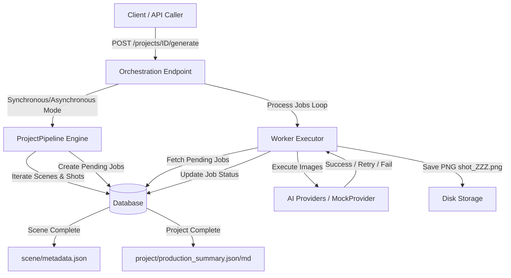

# Sprint 31: End-to-End Scene Generation MVP

This document describes the design, architecture, endpoint interfaces, retry policies, failure recovery, and output directory layout implemented in Sprint 31.

---

## 1. Overview & Architecture

The primary goal of Sprint 31 is to support triggering the full image generation pipeline for an entire project with a single API call. This orchestrates:

1. **Sequential Scene Iteration**: Triggering `ProjectPipeline` for all scenes within the project.
2. **Sequential Worker Execution**: Polling and executing the generated worker jobs.
3. **Structured Storage Layout**: Writing files directly into structured scene directories under the project root.
4. **Resilient Failure Recovery**: Attempting retries for transient errors while continuing execution when non-recoverable errors or permanent failures occur.

### System Diagram



---

## 2. Endpoint Interfaces

### 2.1 Trigger Generation
* **Path**: `POST /projects/{project_id}/generate`
* **Query Parameters**:
  * `async_mode` (bool, default `true`): If `true`, the generation loop executes in a background thread, and the endpoint returns immediately. If `false`, it blocks until all shots have been fully processed.
* **Response (Sync / Completed)**:
  ```json
  {
    "message": "Project generation completed",
    "project_id": 1,
    "status": "completed",
    "total_shots": 9,
    "completed_shots": 8,
    "failed_shots": 1
  }
  ```
* **Response (Async / Started)**:
  ```json
  {
    "message": "Project generation started in background",
    "project_id": 1,
    "status": "processing",
    "total_shots": 9,
    "completed_shots": 0,
    "failed_shots": 0
  }
  ```

### 2.2 Get Generation Status
* **Path**: `GET /projects/{project_id}/generation-status`
* **Response**:
  ```json
  {
    "status": "processing",
    "total_shots": 9,
    "completed_shots": 3,
    "failed_shots": 0,
    "current_scene": {
      "id": 1,
      "scene_number": 1,
      "title": "Scene 1 title"
    },
    "current_shot": {
      "id": 12,
      "shot_number": 3,
      "status": "processing"
    },
    "provider_metrics": {
      "mock": 3
    }
  }
  ```

---

## 3. Retry Policies & Failure Recovery

AI Studio implements structured error handling to distinguish between recoverable transient errors and unrecoverable errors:

| Category | HTTP Codes / Error Types | Retry Behavior | Maximum Retries |
| :--- | :--- | :--- | :--- |
| **Retryable (Transient)** | `429` (Rate Limited), Timeout, Connection/Network Errors | Increment `retry_count`, job remains `pending` | `3` |
| **Non-Retryable (Permanent)** | `400` (Bad Request), `401` (Unauthorized), `403` (Forbidden), `404` (Not Found) | Mark job `failed` immediately | `0` |

### Failure Recovery Policy
To ensure that a single permanently failed shot does not halt the entire production:
- If a shot fails permanently (or exhausts its 3 retries), the pipeline marks it as `failed` and proceeds to the next shots and scenes.
- The scene is marked `completed` once all of its shots reach a terminal state (`completed` or `failed`).
- The project is marked `completed` once all scenes have finished execution.

---

## 4. Output Folder Directory Layout

All assets and metadata files are saved in the `generated/` directory structure:

```
generated/
  Project_001/
    production_summary.json     # Overall metrics, completed/failed shot counts, and asset mappings
    production_summary.md       # Human-readable markdown summary of the project production
    Scene_001/
      metadata.json             # Scene title, narrative summary, and list of shot details
      shot_001.png              # Generated image files
      shot_002.png
    Scene_002/
      metadata.json
      shot_001.png
```

### 4.1 scene/metadata.json
Written automatically upon scene completion:
```json
{
  "project_id": 1,
  "scene_id": 1,
  "scene_number": 1,
  "title": "Scene Title",
  "summary": "Scene narrative description...",
  "shot_list": [
    {
      "shot_number": 1,
      "prompt": "Shot prompt...",
      "status": "completed",
      "asset_path": "Project_001/Scene_001/shot_001.png"
    }
  ]
}
```

### 4.2 project/production_summary.json
Written automatically upon project completion:
```json
{
  "project_id": 1,
  "status": "completed",
  "total_shots": 2,
  "completed_shots": 2,
  "failed_shots": 0,
  "assets": [
    {
      "shot_number": 1,
      "scene_number": 1,
      "prompt": "Prompt text",
      "path": "Project_001/Scene_001/shot_001.png",
      "status": "completed"
    }
  ]
}
```
