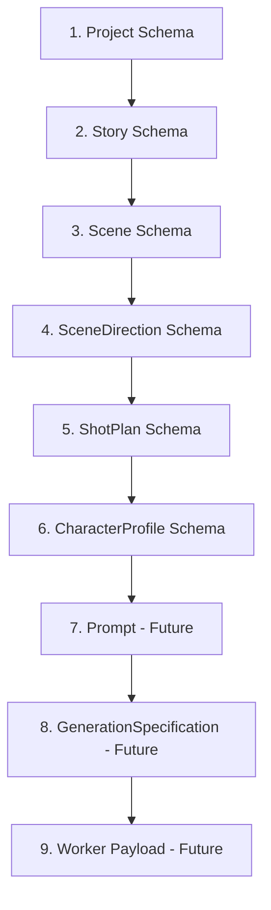

# Pipeline Trace Example

This document presents a complete data-flow trace for a single sample project, "The Runic Quest", illustrating the input, transformation, and output schemas at every stage of the AI Studio backend pipeline (including hypothetical representations for future stages).

---



---

## 1. Project

```json
{
  "id": 1,
  "title": "The Runic Quest",
  "video_type": "medium",
  "target_duration_seconds": 60,
  "aspect_ratio": "16:9",
  "language": "English",
  "art_style": "anime",
  "narration_style": "third_person",
  "subtitle_language": "English",
  "voice_gender": "male",
  "created_at": "2026-06-30T18:00:00Z"
}
```

---

## 2. Story

```json
{
  "id": 12,
  "project_id": 1,
  "title": "The Runic Quest",
  "genre": "Fantasy",
  "summary": "A young mage discovers a glowing runic stone in an ancient forest.",
  "story_text": "Kai walked into the whispering woods. He saw a stone glowing with runic energy. As he touched it, ancient magic was unleashed.",
  "status": "completed",
  "version": 1,
  "created_at": "2026-06-30T18:01:00Z"
}
```

---

## 3. Scene

```json
{
  "id": 101,
  "episode_id": 51,
  "scene_number": 1,
  "title": "Whispering Woods",
  "narration": "Kai walked into the whispering woods, his staff held high.",
  "camera_notes": "Follow character tracking shot through dense foliage.",
  "duration_seconds": 12.0,
  "status": "completed",
  "created_at": "2026-06-30T18:02:00Z"
}
```

---

## 4. SceneDirection

```json
{
  "scene_id": 101,
  "mood": "Mysterious",
  "lighting": "Dappled forest light, glowing moss",
  "primary_focus": "Kai holding his staff",
  "camera_style": "Handheld tracking",
  "suggested_shots": [
    {
      "shot_number": 1,
      "shot_type": "Establishing",
      "camera_angle": "Eye Level",
      "camera_movement": "Static",
      "composition": "Rule of Thirds",
      "duration_seconds": 4.0,
      "focus_subject": "Ancient forest",
      "narration_text": "Whispering woods"
    },
    {
      "shot_number": 2,
      "shot_type": "Medium Shot",
      "camera_angle": "Low Angle",
      "camera_movement": "Tracking",
      "composition": "Leading Lines",
      "duration_seconds": 8.0,
      "focus_subject": "Kai holding staff",
      "narration_text": "Kai walked through dense foliage"
    }
  ],
  "estimated_duration": 12.0
}
```

---

## 5. ShotPlan

```json
[
  {
    "scene_id": 101,
    "shot_number": 1,
    "shot_type": "Establishing",
    "camera_angle": "Eye Level",
    "camera_movement": "Static",
    "composition": "Rule of Thirds",
    "focus_subject": "Ancient forest",
    "duration_seconds": 4.0,
    "transition_in": "Fade In",
    "transition_out": "Cut",
    "description": "Wide view of whispering woods with ancient trees.",
    "visual_notes": "Dappled forest light, glowing moss",
    "scene_direction_id": null,
    "metadata": {}
  },
  {
    "scene_id": 101,
    "shot_number": 2,
    "shot_type": "Medium Shot",
    "camera_angle": "Low Angle",
    "camera_movement": "Tracking",
    "composition": "Leading Lines",
    "focus_subject": "Kai holding staff",
    "duration_seconds": 8.0,
    "transition_in": "Cut",
    "transition_out": "Fade Out",
    "description": "Kai walking through dense foliage.",
    "visual_notes": "Staff glows with faint blue light.",
    "scene_direction_id": null,
    "metadata": {}
  }
]
```

---

## 6. CharacterProfile

```json
{
  "character_id": 5,
  "canonical_name": "Kai",
  "aliases": ["Commander Kai", "Kai of Whispering Woods"],
  "appearance_summary": "Young mage with silver hair and blue eyes, wearing simple apprentice robes.",
  "hairstyle": "Messy silver hair",
  "hair_color": "Silver",
  "eye_color": "Blue",
  "skin_tone": "Fair",
  "body_type": "Slender",
  "age_group": "Young adult",
  "default_outfit": "Apprentice wizard robes with runic embroidery",
  "accessories": "Carved wooden staff with a small blue crystal at the tip",
  "expression_defaults": "Determined",
  "pose_defaults": "Holding staff",
  "visual_notes": "Ensure staff crystal glows in dark environments",
  "reference_prompt": "1boy, solo, silver hair, blue eyes, apprentice wizard robes, holding crystal staff",
  "negative_prompt": "modern clothing, glasses, beard, mustache",
  "scene_history": [101, 102],
  "shot_history": [2],
  "metadata": {
    "status": "approved",
    "role": "protagonist"
  }
}
```

---

## 7. Prompt (Future)

```json
{
  "shot_id": "101_2",
  "positive_prompt": "anime style, medium shot, low angle, leading lines, Kai holding staff, messy silver hair, blue eyes, apprentice wizard robes, walking through dense foliage, whispering woods, dappled forest light, glowing moss, staff glows with faint blue light, high quality",
  "negative_prompt": "modern clothing, glasses, beard, mustache, blurry, low resolution"
}
```

---

## 8. GenerationSpecification (Future)

```json
{
  "provider": "flux",
  "parameters": {
    "prompt": "anime style, medium shot, low angle, leading lines, Kai holding staff, messy silver hair, blue eyes, apprentice wizard robes, walking through dense foliage, whispering woods, dappled forest light, glowing moss, staff glows with faint blue light, high quality",
    "negative_prompt": "modern clothing, glasses, beard, mustache, blurry, low resolution",
    "width": 1024,
    "height": 576,
    "steps": 30,
    "guidance_scale": 7.5,
    "seed": 422049182
  }
}
```

---

## 9. Worker Payload (Future)

```json
{
  "job_id": "job_8123984_101_2",
  "task_type": "image_generation",
  "provider": "flux",
  "payload": {
    "prompt": "anime style, medium shot, low angle, leading lines, Kai holding staff, messy silver hair, blue eyes, apprentice wizard robes, walking through dense foliage, whispering woods, dappled forest light, glowing moss, staff glows with faint blue light, high quality",
    "width": 1024,
    "height": 576,
    "num_inference_steps": 30,
    "guidance_scale": 7.5,
    "seed": 422049182
  },
  "callback_url": "http://backend:8000/api/v1/jobs/job_8123984_101_2/callback"
}
```
