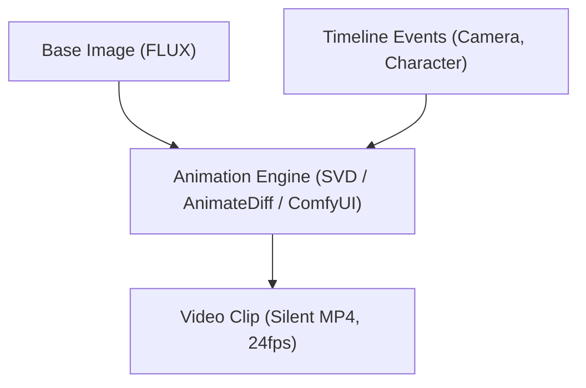
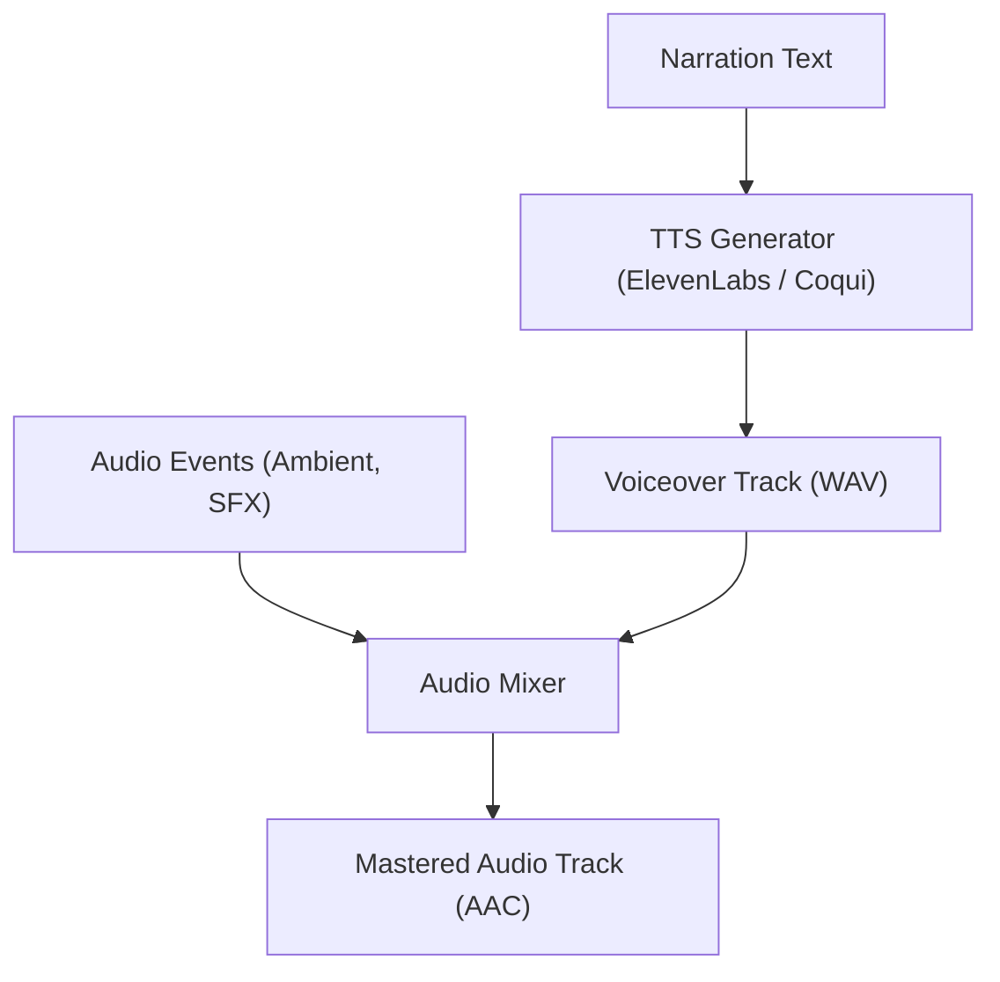
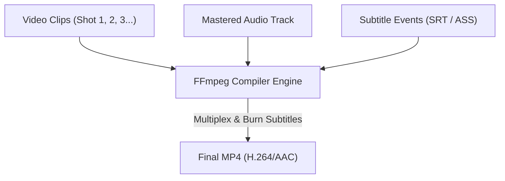

# Animation & Video Pipeline

The final output of AI Studio is not a collection of static images, but a fully compiled cinematic video sequence. The animation pipeline coordinates the translation of storyboard descriptions and timeline directing events into video clips.

## 1. Frame-to-Video Synthesis
Static images generated in the initial phase serve as keyframe anchors (Image-to-Video). The animation layer drives motion based on parameters specified in `timeline_events`.

### Implementing Camera Motion
Timeline events map directly to camera motion algorithms inside ComfyUI or RunPod nodes:
* **`zoom_in` / `zoom_out`:** Driven by scale/zoom zoom parameters in the latent space.
* **`pan_left` / `pan_right`:** Latent translation coordinates shifted horizontally.
* **`orbit`:** 3D camera projections guided by motion control vectors (e.g., CameraCtrl / ControlNet).

## 2. Audio & Narration Assembly
Narration text associated with the scene is sent to a TTS (Text-to-Speech) provider.

## 3. Final Compositing (The Rendering Engine)
A dedicated rendering step combines the video clips, audio tracks, and subtitles into a single container.

## 4. Architectural Requirements
To support this pipeline, the following abstractions must be preserved:
1. **In-Memory Image Passing:** Image Providers must return raw image objects (e.g., `PIL.Image` or byte streams) to allow downstream animation providers to consume them directly without writing intermediate files to disk.
2. **Deterministic Sequence Ordering:** Shot sequences must be sorted numerically to prevent FFmpeg compilation order issues.
