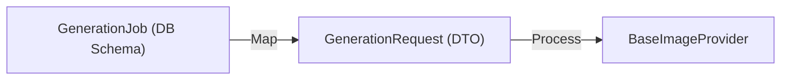
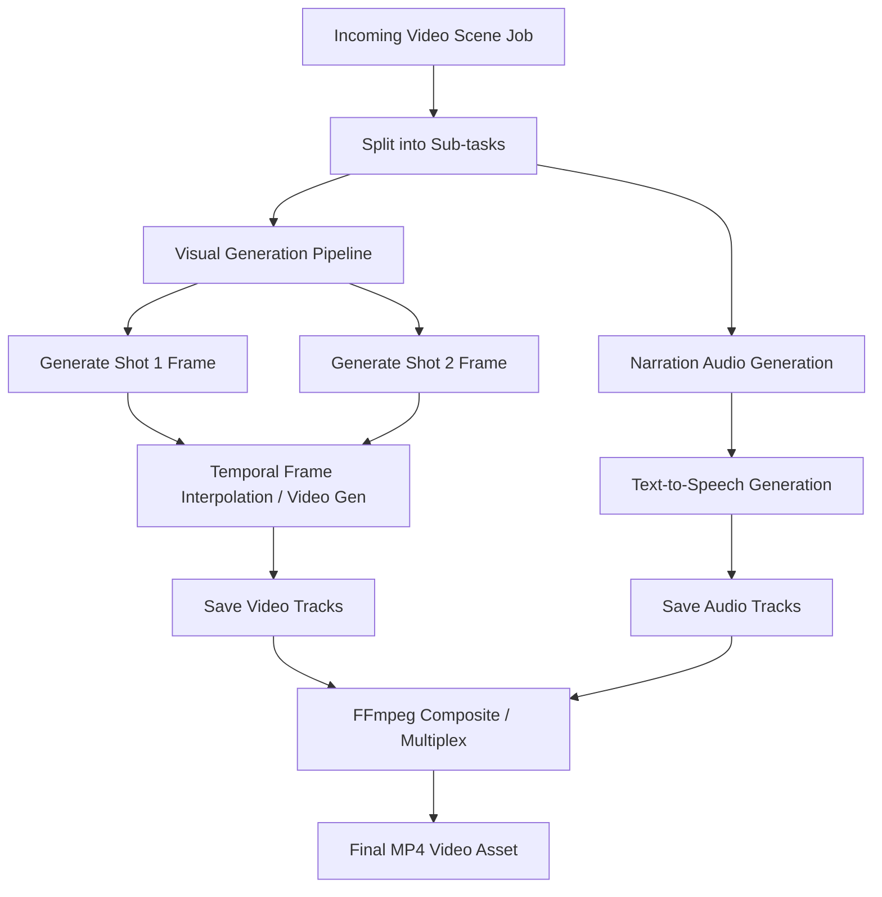

# Future Pipeline Design

As AI Studio transitions from a single-job image worker to a multi-modal rendering pipeline, the generation flow will be upgraded to support concurrent steps, caching, and complex asset dependencies.

## 1. Decoupling: GenerationRequest DTOs
Currently, the image providers receive a database model `GenerationJob` directly:
```python
def generate(self, job: GenerationJob) -> Image.Image:
```
This couples providers to database schemas and the backend's job queue representation. In a future sprint, we will introduce a clean **DTO (Data Transfer Object)** pattern:



```python
@dataclass
class GenerationRequest:
    prompt: str
    negative_prompt: Optional[str]
    width: int
    height: int
    seed: Optional[int] = None
    parameters: Dict[str, Any] = field(default_factory=dict)
```
This ensures providers remain stateless and completely decoupled from database fields.

## 2. Parallel & Pipeline Flow
Instead of a simple synchronous linear pipeline (fetch → generate → store → complete), the future pipeline will process sub-tasks in parallel:



## 3. Caching & Incremental Re-generation
To avoid redundant compute and lower costs, a pipeline cache will be introduced:
* **Prompt Hashing:** Calculate MD5 hashes of prompts, character descriptions, and visual parameters.
* **Storage Lookup:** Before running inference, check if a generated asset with the same hash already exists in storage.
* **Partial Re-runs:** If a user edits only Shot 3 in a 10-shot scene, only Shot 3 is re-generated; the rest are pulled from cache and re-composited.
