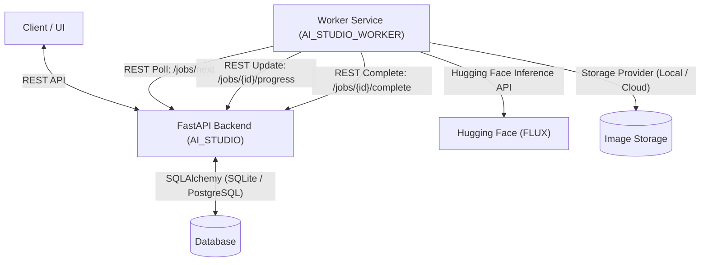
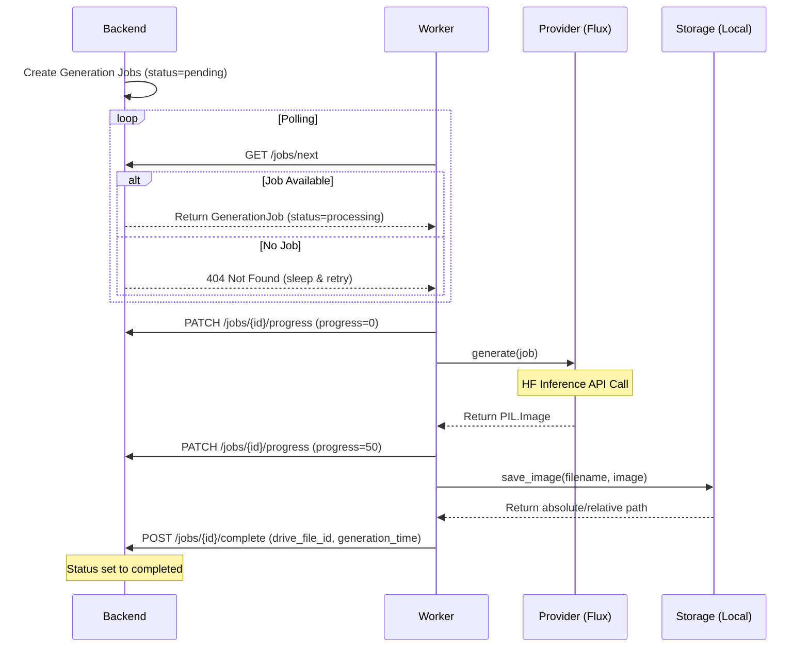

# Overall Architecture

AI Studio is structured as a decoupled, modular system consisting of a main API backend and one or more independent worker instances. This decoupling ensures that heavy AI inference tasks do not block web request handling or database transactions.

## Component Overview

### 1. Main Backend (`AI_STUDIO`)
The backend is a FastAPI application managing the core data models, business logic, prompt building engine, and job queue.
* **REST API:** Serves endpoints for projects, stories, episodes, scenes, characters, and storyboard generation.
* **Database (SQLAlchemy):** Persists the structural hierarchy (Project → Story → Episode → Scene). Includes a unified `timeline_events` table for scene directing events.
* **Prompt Builder Engine:** Dynamically constructs detailed positive and negative prompts based on scene descriptions, camera parameters, and character visual attributes.
* **Job Queue:** Provides a simple priority queue where jobs are created for each storyboard shot and stored in the database as `pending`.

### 2. Worker Service (`AI_STUDIO_WORKER`)
The worker is a lightweight Python service designed to poll the backend, perform heavy tasks, and upload/save results.
* **Queue Poller:** Periodically queries `/jobs/next` on the backend.
* **Executor:** Coordinates image generation and storage.
* **Image Providers:** Abstracted modules implementing `BaseImageProvider`. Currently supports `MockProvider` and `FluxProvider` (Hugging Face Inference).
* **Storage Providers:** Abstracted modules implementing `BaseStorage`. Currently supports `LocalStorage` (saving to disk).
* **Reporter:** Handles calling progress and completion API endpoints on the backend to keep the job lifecycle updated.

## Job Lifecycle

