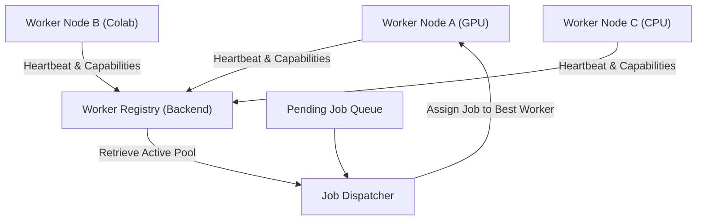

# Worker Registry Design

As volume increases, a single worker instance running on a loop will not suffice. AI Studio will scale horizontally to support multiple workers running on different GPU nodes (e.g., local server, runpod instances, colab notebooks).

To manage this pool of active instances, we will introduce a **Worker Registry** on the backend.

## Conceptual Architecture



## 1. Registration & Heartbeats
Each worker registers itself with the backend at startup and sends periodic heartbeats (e.g., every 30 seconds) to signal availability.

* **Register Payload:**
  ```json
  {
    "worker_id": "worker-runpod-09",
    "version": "0.2.0",
    "capabilities": {
      "image_generation": ["flux", "sdxl"],
      "video_generation": ["svd"],
      "device": "cuda:0",
      "vram_gb": 24
    }
  }
  ```

If the backend does not receive a heartbeat from a worker within 90 seconds, the worker is marked `offline` and any leased/active jobs assigned to it are automatically returned to `pending` status.

## 2. Capability-Based Routing
Instead of workers polling a single generic `/jobs/next` endpoint, jobs will be routed based on worker capabilities and configuration settings:
* **Audio-only workers:** Poll only TTS and sound-effect tasks.
* **Low-VRAM workers:** Process only `sdxl` or mock tasks.
* **High-VRAM workers:** Lease heavy tasks like `flux` or high-resolution video interpolation.

## 3. Job Lease Pattern
To prevent race conditions where multiple workers try to process the same job:
1. **Request:** Worker requests a job matching its capabilities.
2. **Lease:** Backend assigns the job, marks it as `processing`, sets `leased_by = worker_id`, and sets a `leased_until` timestamp.
3. **Completion/Timeout:** Worker completes the job and calls `/jobs/{id}/complete`. If the worker crashes, the lease expires and the job becomes available for dispatching again.
