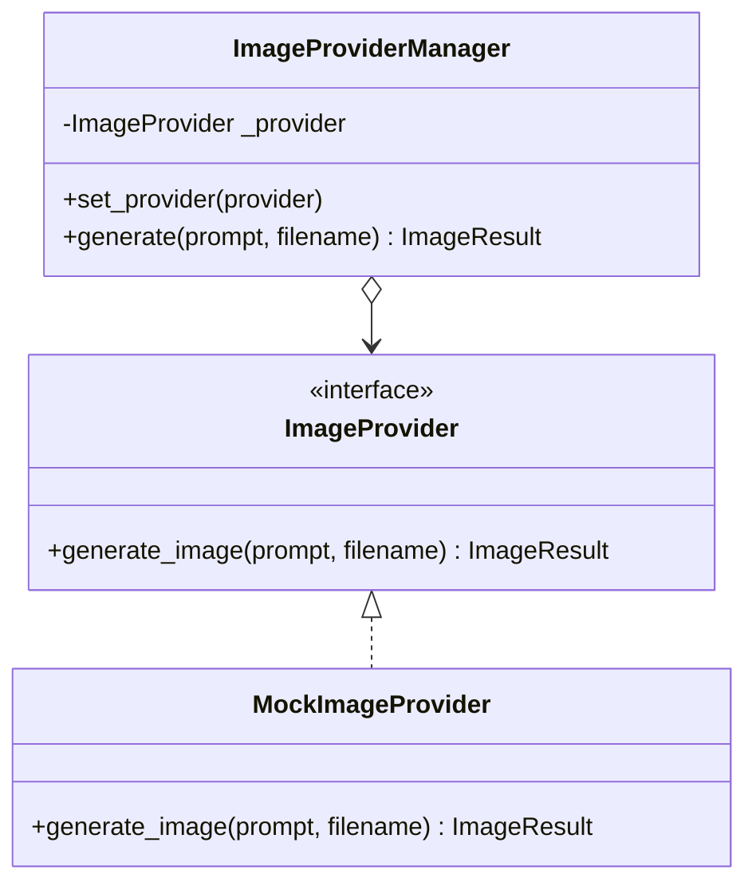

# Sprint 11 — Image Provider Framework

**Date:** 2026-06-29  
**Branch:** `sprint-11-image-provider-framework` (merged into `main`)  
**Commit Hash:** `7966487` (`7966487c9c9d26e43dfef0421e7dac08a7b8f1bb`)

---

## Files Created

| File | Change Type | Purpose |
|------|-------------|---------|
| `app/providers/image/base.py` | Created | Abstract base class `ImageProvider` defining `generate_image(prompt, filename)`. |
| `app/providers/image/models.py` | Created | Schema representing the output structure (`ImageResult`). |
| `app/providers/image/mock_provider.py` | Created | Concrete implementation `MockImageProvider` drawing placeholder PNGs with Pillow. |
| `app/providers/image/manager.py` | Created | Manager class `ImageProviderManager` implementing active provider switching (`set_provider`, `generate`). |
| `app/providers/image/__init__.py` | Created | Package initialization registering global manager `image_provider_manager`. |
| `app/api/images.py` | Created | Router exposing `/scenes/{scene_id}/generate-image` endpoint. |
| `notes/Sprint_11.md` | Created | Documentation journal for Sprint 11. |

---

## Architecture & Provider Design

The framework is built using the **Strategy Design Pattern**:
1. **Abstraction Layer (`ImageProvider`):** An abstract base class defining the required contract for generating images.
2. **Strategy Classes (e.g. `MockImageProvider`):** Concrete implementations of the base class. The mock provider renders 800x600 dark slate PNG files containing key descriptive texts using Pillow.
3. **Context Layer (`ImageProviderManager`):** Manages the active provider dynamically, allowing runtime switching through `set_provider()` and exposing a unified `generate()` call.



---

## Future Provider Integration

To integrate a new production-ready AI image generator (e.g., Stable Diffusion / Midjourney / DALL-E):
1. **Implement custom provider:** Create a new file (e.g. `app/providers/image/dalle_provider.py`) inheriting from `ImageProvider`.
2. **Implement `generate_image`:** Write the REST API invocation to the DALL-E endpoint, download the generated image, save it locally, and return `ImageResult`.
3. **Register new provider:** Configure `image_provider_manager` inside the API router or app initialization:
   ```python
   from app.providers.image.dalle_provider import DalleImageProvider
   image_provider_manager.set_provider(DalleImageProvider())
   ```

---

## Regression Status

All endpoints from Sprints 1-11 are fully verified and passing:
- **Projects:** Config creation and fetching.
- **Stories & Episodes:** Relational mappings.
- **Scenes:** Retrieval and configurations.
- **Blueprint:** Story blueprint calculations.
- **Characters:** Registry creation and scene-character assignments.
- **Storyboard Generator:** Ordered shot durations and transition details.
- **Prompt Engine:** Visual descriptive tags.
- **Image Provider Framework:** Mock image generation, local file storage, and active provider delegation.
