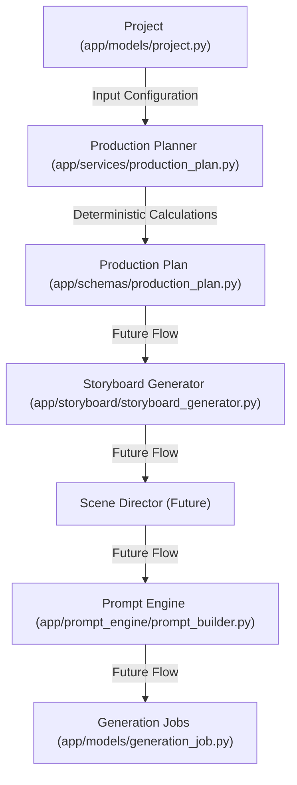
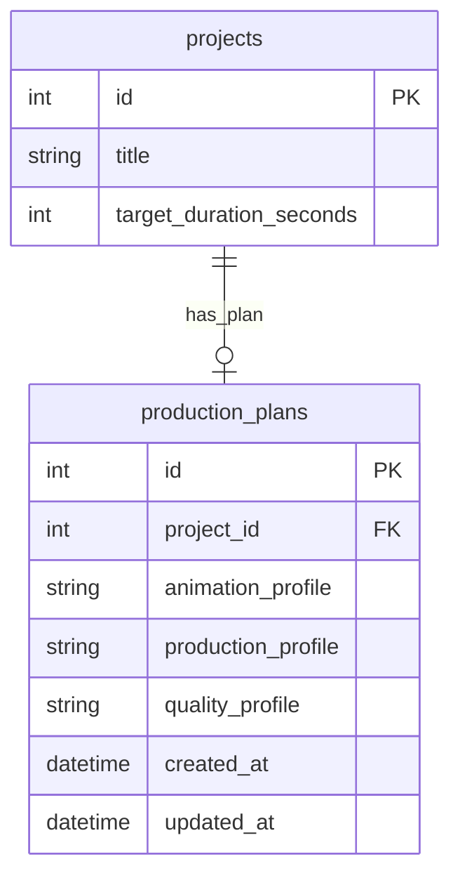

# Sprint 16 — Production Planner Foundation

**Date:** 2026-06-29  
**Branch:** `main` (backend)  
**Commit Hash:** `f6140b9`  

---

## Architecture Diagram

The role of the Production Planner in the AI Studio pipeline:



---

## Database Changes

A new lightweight table `production_plans` was introduced to store the planning metadata linked to the `projects` table (1-to-1 relationship).



* **Migration File:** `alembic/versions/450977dccc60_create_production_plans_table.py`
* **Table Schema:**
  * `id`: Integer (Primary Key, Auto-increment)
  * `project_id`: Integer (Unique, Foreign Key referencing `projects.id` with cascade on delete)
  * `animation_profile`: Enum (Values: `basic`, `standard`, `high`, `cinema`)
  * `production_profile`: Enum (Values: `shorts`, `reel`, `long_form`, `series`)
  * `quality_profile`: Enum (Values: `draft`, `standard`, `high`, `ultra`)
  * `created_at`: DateTime
  * `updated_at`: DateTime

---

## Files Created

* `app/models/production_plan.py` — Database model defining profiles and fields.
* `app/schemas/production_plan.py` — Pydantic request (`ProductionPlanUpdate`) and response (`ProductionPlanResponse`) schemas.
* `app/services/production_plan.py` — Core calculation service executing deterministic calculations based on planning profiles and target duration.
* `verify_sprint_16.py` — Integration tests validating calculation logic and REST endpoints.
* `notes/Sprint_16.md` — Documentation.

---

## Files Modified

* `app/models/project.py` — Declared `production_plan` relationship (1-to-1).
* `app/models/__init__.py` — Registered `ProductionPlan` on the SQLAlchemy Base metadata.
* `app/api/projects.py` — Registered GET and PUT endpoints for the production planner.

---

## API Endpoints

### 1. GET `/projects/{project_id}/production-plan`
Calculates and returns the estimated production values. If no plan has been customized and saved for the project yet, standard default profiles are fallback-evaluated dynamically without database mutation.
* **Method:** `GET`
* **Response Status:** `200 OK`
* **Error Response:** `404 Not Found` (if project does not exist)

### 2. PUT `/projects/{project_id}/production-plan`
Saves or updates customized profiles (`animation_profile`, `production_profile`, `quality_profile`) in the database, triggering recalculation of all planning estimates.
* **Method:** `PUT`
* **Payload:**
  ```json
  {
    "animation_profile": "cinema",
    "production_profile": "reel",
    "quality_profile": "ultra"
  }
  ```
* **Response Status:** `200 OK`
* **Error Response:** `404 Not Found` (if project does not exist)

---

## Example Response

Executing `GET /projects/1/production-plan` on standard defaults:

```json
{
  "id": null,
  "project_id": 1,
  "animation_profile": "standard",
  "production_profile": "long_form",
  "quality_profile": "standard",
  "target_runtime_seconds": 600,
  "estimated_scene_count": 40,
  "estimated_shot_count": 160,
  "estimated_keyframe_count": 320,
  "estimated_image_count": 320,
  "estimated_narration_duration": 540.0,
  "estimated_storage_mb": 320.0,
  "estimated_render_minutes": 10.67,
  "created_at": null,
  "updated_at": null
}
```

---

## Lessons Learned
1. **Dynamic Defaults without Database Mutation:** Serving dynamic fallback calculations when a one-to-one record does not yet exist is an elegant pattern for read-only GET requests. This satisfies database safety constraints without cluttering the database with duplicate default configurations.
2. **Deterministic Estimations Scale cleanly:** Translating logical constraints (like shots-per-scene and size-per-image) into enum configurations enables calculations to easily scale from a 15-second short to multi-hour series without database schema redesign.

---

## Regression & Verification Summary
* Verified via `verify_sprint_16.py` using a temporary SQLite database.
* Successfully tested standard calculation logic, profile updates, and error cases (non-existent projects).
* Ran previous `verify_sprint_15.py` test suite; all worker/job/failure endpoints continue to pass without regressions.
