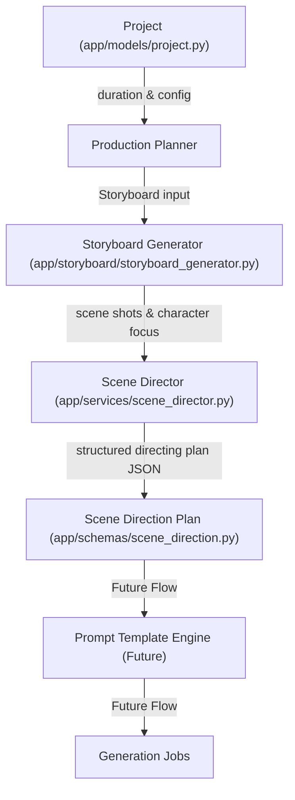
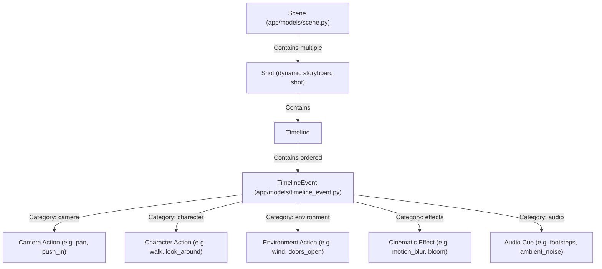
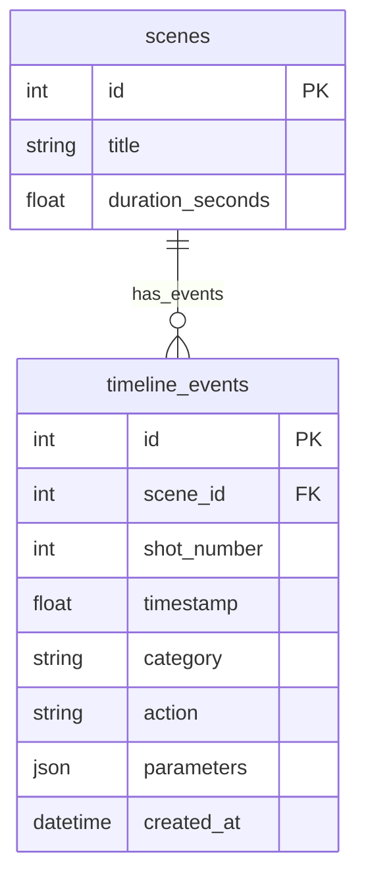

# Sprint 17 — Scene Director Foundation

**Date:** 2026-06-29  
**Branch:** `main` (backend)  
**Commit Hash:** `16b5ecb`  

---

## Architecture Diagram

The integration of the Scene Director inside the AI Studio pipeline:



---

## Timeline Architecture Diagram

The hierarchical structure of the Scene Director timeline planning:



---

## Database Changes

A single generic table `timeline_events` was introduced. This table acts as a unified repository for all event categories (camera, character, environment, effects, audio) using a flexible JSON field.



* **Migration File:** `alembic/versions/945db6675927_create_timeline_events_table.py`
* **Table Schema:**
  * `id`: Integer (Primary Key, Auto-increment)
  * `scene_id`: Integer (Foreign Key referencing `scenes.id` with cascade on delete)
  * `shot_number`: Integer (Associates the event with a specific shot number in the storyboard)
  * `timestamp`: Float (Relative offset in seconds from the start of the shot)
  * `category`: String (Category of event, e.g. `camera`, `character`, `effects`)
  * `action`: String (Specific action name, e.g. `push_in`, `walk`, `motion_blur`)
  * `parameters`: JSON (Arbitrary parameter dictionary)
  * `created_at`: DateTime

---

## Files Created

* `app/models/timeline_event.py` — Database model defining the generic `timeline_events` table structure.
* `app/schemas/scene_direction.py` — Pydantic response (`SceneDirectionResponse`) and update (`SceneDirectionUpdate`) schemas.
* `app/services/scene_director.py` — Scene director service that merges custom database events with deterministic fallbacks to construct a complete directing plan.
* `verify_sprint_17.py` — Integration tests validating scene directing calculations, custom event persistence, and API behavior.
* `notes/Sprint_17.md` — Documentation.

---

## Files Modified

* `app/models/scene.py` — Registered 1-to-many relationship with `TimelineEvent`.
* `app/models/__init__.py` — Registered `TimelineEvent` on the SQLAlchemy Base metadata.
* `app/api/scenes.py` — Added GET and PUT endpoints for scene direction.

---

## API Endpoints

### 1. GET `/scenes/{scene_id}/direction`
Generates and returns the complete directing plan. If no custom timeline events have been saved, it fallback-calculates default events (camera, character, environment, effects, audio) and estimated keyframes deterministically.
* **Method:** `GET`
* **Response Status:** `200 OK`
* **Error Response:** `404 Not Found` (if scene does not exist)

### 2. PUT `/scenes/{scene_id}/direction`
Allows saving custom timeline events for the scene, overwriting any previously stored events.
* **Method:** `PUT`
* **Payload:**
  ```json
  {
    "timeline_events": [
      {
        "shot_number": 1,
        "timestamp": 1.2,
        "category": "camera",
        "action": "orbit",
        "parameters": {"speed": "fast"}
      }
    ]
  }
  ```
* **Response Status:** `200 OK`
* **Error Response:** `404 Not Found` (if scene does not exist)

---

## Example Scene Direction JSON (GET Response)

```json
{
  "scene_id": 1,
  "scene_title": "Scene 17 Outer Space",
  "narration": "In the cold depth of space...",
  "camera_notes": "Follow space ship",
  "duration_seconds": 12.0,
  "shots": [
    {
      "shot_number": 1,
      "shot_type": "Wide",
      "camera_angle": "High Angle",
      "duration_seconds": 4.0,
      "focus_characters": [
        "Captain-17"
      ],
      "description": "Wide shot showing Captain-17. In the cold depth of space...",
      "transition": "cut",
      "timeline": [
        {
          "timestamp": 0.0,
          "category": "camera",
          "action": "pan",
          "parameters": {
            "speed": "slow",
            "focus": "auto"
          }
        },
        {
          "timestamp": 0.5,
          "category": "character",
          "action": "look_around",
          "parameters": {
            "character_name": "Captain-17",
            "speed": "normal"
          }
        },
        {
          "timestamp": 0.0,
          "category": "environment",
          "action": "ambient_wind",
          "parameters": {
            "intensity": "low"
          }
        },
        {
          "timestamp": 0.0,
          "category": "effects",
          "action": "motion_blur",
          "parameters": {
            "strength": "medium"
          }
        },
        {
          "timestamp": 0.0,
          "category": "audio",
          "action": "ambient_noise",
          "parameters": {
            "volume": 0.4,
            "loop": true
          }
        }
      ],
      "estimated_keyframes": [
        {
          "id": 1,
          "timestamp": 0.0,
          "description": "Start of shot - Establishing composition"
        },
        {
          "id": 2,
          "timestamp": 2.0,
          "description": "Midpoint of shot - Motion peak"
        },
        {
          "id": 3,
          "timestamp": 4.0,
          "description": "End of shot - Transition frame"
        }
      ]
    }
  ]
}
```

---

## Lessons Learned
1. **Generic Event Model over Explicit Subclassing:** Representing all directing actions (camera, audio, character, visual effects) under a single `TimelineEvent` database model with a generic category and parameters dictionary avoids schema bloat and enables third-party/future action extension without DB migration overhead.
2. **Deterministic Defaults merging with Custom Events:** By resolving DB queries on a per-shot level, we can seamlessly merge manually customized timeline edits with fallback default generators.

---

## Regression & Verification Summary
* Verified via `verify_sprint_17.py` in a separate SQLite instance.
* Verified that default event generation maps camera and character parameters cleanly, and that custom event saving updates the database correctly.
* Re-ran previous `verify_sprint_15.py` and `verify_sprint_16.py` test runner suites; all checks pass cleanly.
