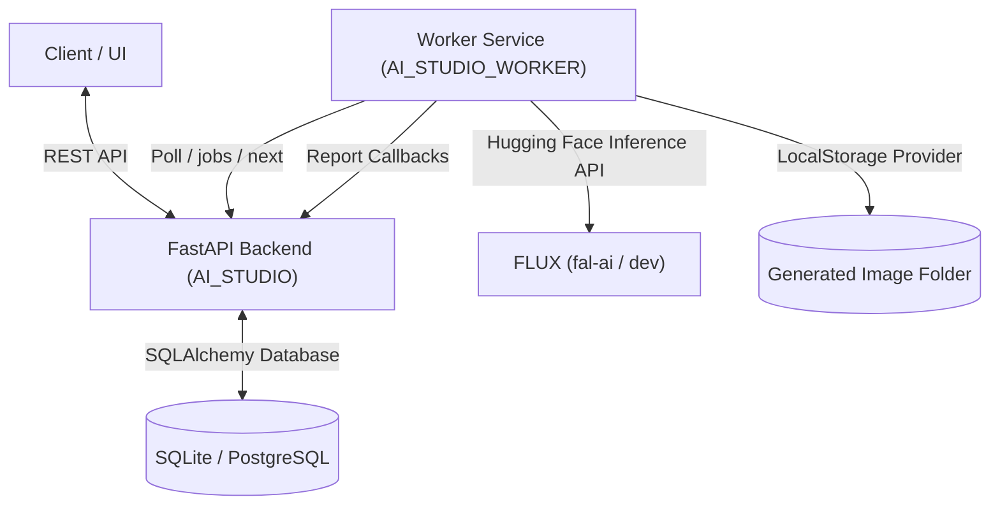

# AI Studio — Project Summary

This document provides a comprehensive summary of the current state of the AI Studio project, encompassing both the **Backend Engine (`AI_STUDIO`)** and the **Worker Daemon (`AI_STUDIO_WORKER`)**.

---

## 1. Project Overview & Architecture

AI Studio is an automated pipeline designed to generate full video production assets starting from high-level story prompts down to synchronized, rendered video clips. The system is split into two major repositories:

1. **`AI_STUDIO` (Backend):** A FastAPI server managing user projects, stories, episodes, scene breakdowns, characters, directing templates, and generation jobs.
2. **`AI_STUDIO_WORKER` (Worker):** A stateless daemon polling the backend for generation jobs, invoking AI generation models (e.g., FLUX), saving outputs to storage, and reporting statuses.

---

## 2. Core Repository: AI Studio Backend (`AI_STUDIO`)

The backend is built with **FastAPI**, **SQLAlchemy 2.0**, and **Alembic** migrations. It supports the following key features and entities:

### Data Model Hierarchy
* **Project:** Global settings containing video duration target, aspect ratio (e.g., `16:9`), art style (e.g., `anime`), language, and voice preferences.
* **Story:** Linked to a project, containing the summary and full story text.
* **Episode:** Divisions of stories representing specific episodes.
* **Scene:** Scene breakdowns with duration, narration text, and camera notes.
* **Character:** Story characters tracking detailed visual profiles (hair style/color, skin tone, clothing, reference prompts) to ensure visual consistency.
* **Scene Character Mapping:** Many-to-many relationship assigning characters to specific scenes.
* **Timeline Event:** Unified table tracking actions (camera pan/zoom, character movements, audio cues) mapped to scene timestamps.
* **Generation Job:** Tracks the lifecycle of shot-level asset generation (`pending`, `processing`, `completed`, `failed`).

### Prompt Engine
* **Storyboard Generator:** Dynamically compiles a storyboard for scenes based on scene duration and focus characters. Determines shot compositions (Wide establishing shots, Medium shots focusing on character action, and Close-up ending shots).
* **Prompt Builder:** Combines project art style, camera angles, narration text, and detailed character visual profiles into rich, detailed positive and negative prompts optimized for diffusion models.

### API Services Scaffolding (Sprint 19 Setup)
* **`app/services/ai/`**: Scaffolded interfaces for `story_generator`, `character_generator`, `prompt_generator`, `image_generator`, `checkpoint_manager`, and `queue_manager`.
* **`app/prompts/`**: Prompt templates stored as `.txt` files (`story_prompt`, `character_prompt`, `scene_prompt`, `image_prompt`) to decouple prompts from Python source code.

---

## 3. Worker Repository: AI Studio Worker (`AI_STUDIO_WORKER`)

The worker repository is a lightweight Python service executing image generation tasks:

### Current Architecture
* **Queue Poller:** An infinite loop polling the backend's `/jobs/next` endpoint.
* **Executor:** Responsible for resolving provider selections (`mock` or `flux`) and coordinating the generation-storage pipeline.
* **Mock Provider:** Generates 800x600 dark placeholder images with written prompt text for offline local testing.
* **Flux Provider:** Integrates with the Hugging Face `InferenceClient` using specialized providers (e.g., `fal-ai`) to execute text-to-image inference using the `black-forest-labs/FLUX.1-dev` model.
* **Storage Provider:** Local storage provider saving outputs as PNG files in the local `generated/` folder.
* **Reporter:** Communicates status, progress percentage, completion metadata (storage path, generation time), and failure traceback logs back to the backend endpoints.

---

## 4. Verification & Testing

An integration verification script is located in `c:\Projects\AI_STUDIO\verify_sprint_18.py`.

### E2E Test Workflow
1. **Prepare Pipeline:** The script creates a project, story, episode, scene, character, assigns the character to the scene, generates storyboard shots, compiles prompt engine weights, and queues generation jobs on the backend.
2. **Execute Worker:** Running the worker reads the queued jobs, requests FLUX inference from Hugging Face, saves the result locally, and marks the job as completed.
3. **Verified Output:** Successfully generated highly detailed scene assets (e.g. 1.1 MB PNGs depicting silver-haired green-eyed characters in ancient gardens).

---

## 5. Architectural Design Principles Exposed

1. **Decoupled Heavy Compute:** Heavy GPU/network inference tasks reside strictly in the worker, leaving the backend highly responsive.
2. **Abstract Interface Boundaries:** All providers implement abstract bases (`BaseImageProvider`, `BaseStorage`).
3. **Semantically Classified Errors:** Provider-specific errors (e.g., Hugging Face connection timeouts or auth failures) are translated into standard Python exceptions at the module boundary.
4. **Environment-Driven Configuration:** All credentials (such as `HF_TOKEN`) and run parameters are loaded exclusively from `.env`.
