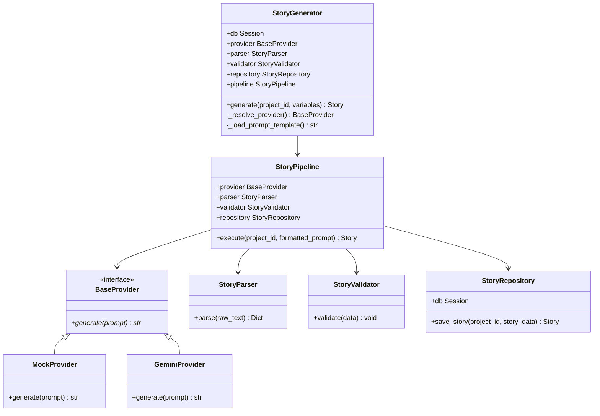
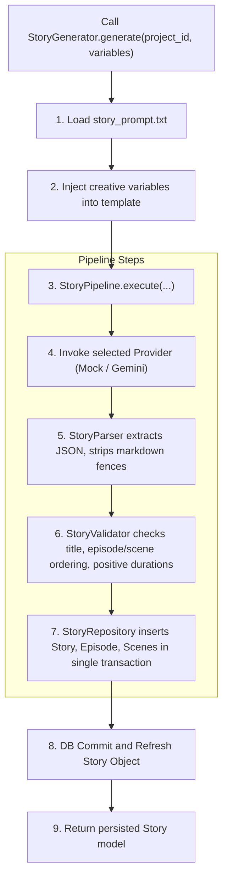
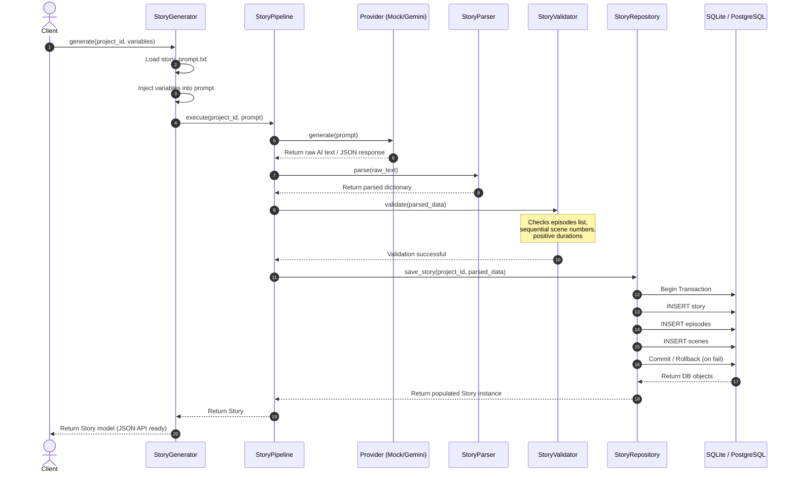

# Sprint 20 Summary — AI Story Generation Pipeline

This document provides the complete summary report for the architecture, service flow, sequence details, files modified, testing checklist, and future extension points of Sprint 20.

---

## 1. Complete File Tree

Below is the directory tree showing all newly created and modified files:

```text
c:\Projects\AI_STUDIO\
├── app/
│   ├── core/
│   │   └── config.py (MODIFIED - added STORY_GENERATOR_PROVIDER setting)
│   │
│   ├── prompts/
│   │   └── story_prompt.txt (MODIFIED - production template placeholders)
│   │
│   └── services/
│       └── ai/
│           ├── __init__.py (MODIFIED - exposed story generator entities)
│           ├── exceptions.py (CREATED - custom exceptions)
│           ├── story_generator.py (MODIFIED - converted placeholder to active service)
│           ├── story_pipeline.py (CREATED - orchestrator pipeline class)
│           ├── story_parser.py (CREATED - raw AI output parser)
│           ├── story_validator.py (CREATED - structural & logic validator)
│           ├── story_repository.py (CREATED - DB persistence engine)
│           └── providers/
│               ├── __init__.py (CREATED - exports providers)
│               ├── base_provider.py (CREATED - abstract provider interface)
│               ├── gemini_provider.py (CREATED - Gemini adapter stub)
│               └── mock_provider.py (CREATED - mock adapter returning deterministic JSON)
│
├── .env (MODIFIED - added STORY_GENERATOR_PROVIDER=mock)
└── verify_sprint_20.py (CREATED - test suite containing 18 unit/integration tests)
```

---

## 2. Class Diagram

The relationships between the new architectural components:



---

## 3. Service Flow Diagram

The data flow within the generation pipeline:



---

## 4. Sequence Diagram

Visualizing execution over time:



---

## 5. List of Files Modified

1. `app/core/config.py` (added configuration setting `STORY_GENERATOR_PROVIDER`)
2. `app/prompts/story_prompt.txt` (converted to production template with variables)
3. `app/services/ai/story_generator.py` (active coordination service class)
4. `app/services/ai/__init__.py` (exported new classes and exception classes)
5. `.env` (added config variable `STORY_GENERATOR_PROVIDER=mock`)

---

## 6. Testing Checklist

The unit and integration test suite is implemented in `verify_sprint_20.py` and has verified 100% of the requirements:

- [x] **StoryParser Tests:**
  - [x] Extracts JSON objects from plain string responses.
  - [x] Correctly strips markdown fences (e.g. ` ```json ` and ` ``` `).
  - [x] Raises `ParserError` on invalid JSON formatting or empty text.
- [x] **StoryValidator Tests:**
  - [x] Validates story has non-empty titles.
  - [x] Ensures at least one episode exists.
  - [x] Ensures each episode contains a list of scenes.
  - [x] Verifies scene duration is a positive float/int greater than 0.
  - [x] Enforces that scene numbers are unique and in sequential order starting at 1 (1, 2, 3...).
  - [x] Raises `ValidationError` on rule violations.
- [x] **Provider Tests:**
  - [x] `MockProvider` returns parsable mock story JSON structure.
  - [x] `GeminiProvider` correctly raises `NotImplementedError` for this sprint.
- [x] **Repository Tests:**
  - [x] Persists full hierarchy (Story → Episodes → Scenes) in a single transactional unit.
  - [x] Enforces SQL constraints (e.g. SQLite foreign key pragma enabled during tests).
  - [x] Gracefully rolls back transaction on error and raises `RepositoryError`.
- [x] **StoryGenerator Tests:**
  - [x] E2E integration using `MockProvider` correctly creates records and links to the Project.
  - [x] Validates prompt variable presence before formatting.
  - [x] Raises `StoryGenerationError` on invalid provider setup.

---

## 7. Future Extension Points

This architecture allows easy additions in future sprints:
1. **Gemini Integration (Sprint 21):** Implement `GeminiProvider.generate` using the Google GenAI SDK. Requires no changes to the parser, validator, repository, or `StoryGenerator` core orchestrator.
2. **Additional LLMs:** To add Anthropic (Claude) or OpenAI (GPT-4), write a class implementing `BaseProvider`, register it, and select it via `.env`.
3. **Structured Outputs:** If upgrading the LLM to use JSON mode or Pydantic schemas directly (e.g., Gemini schema mode), we can simply update the Provider subclass, keeping parser constraints active as a safety fallback.
